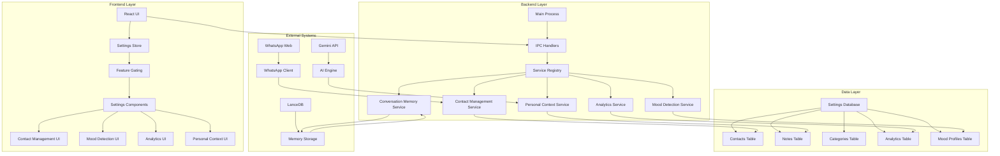
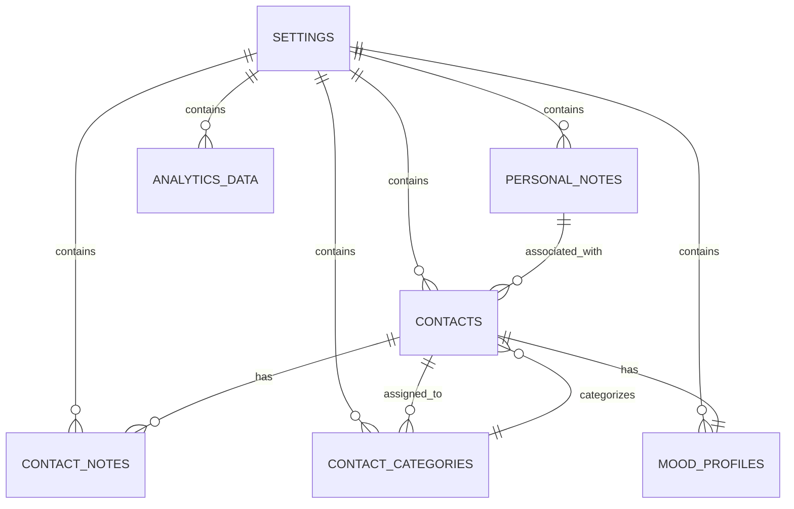
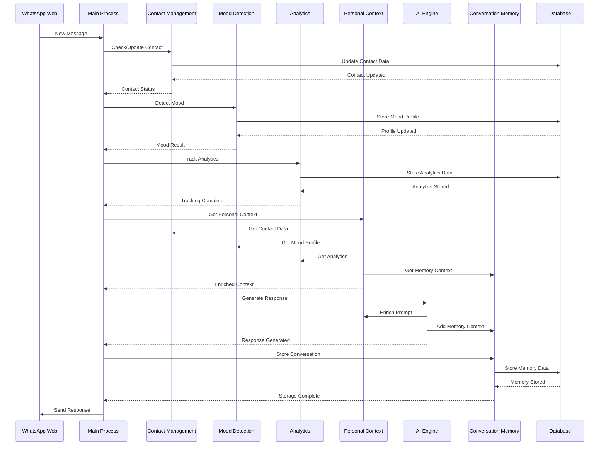
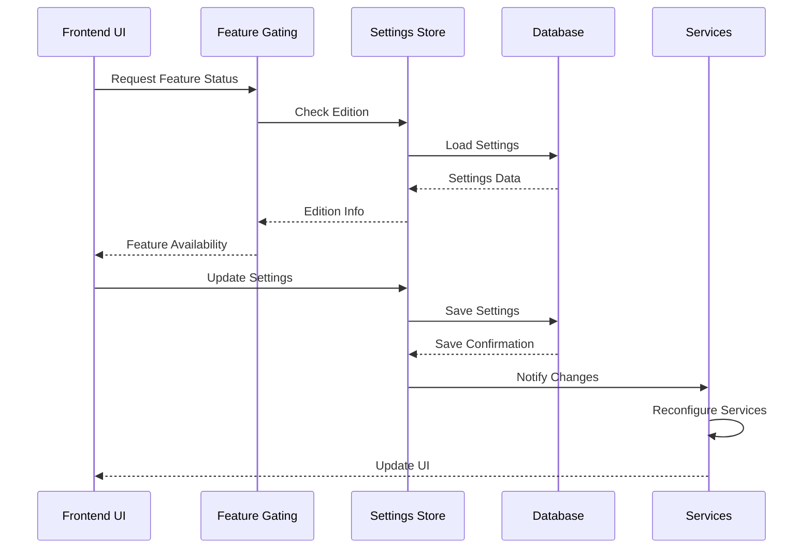
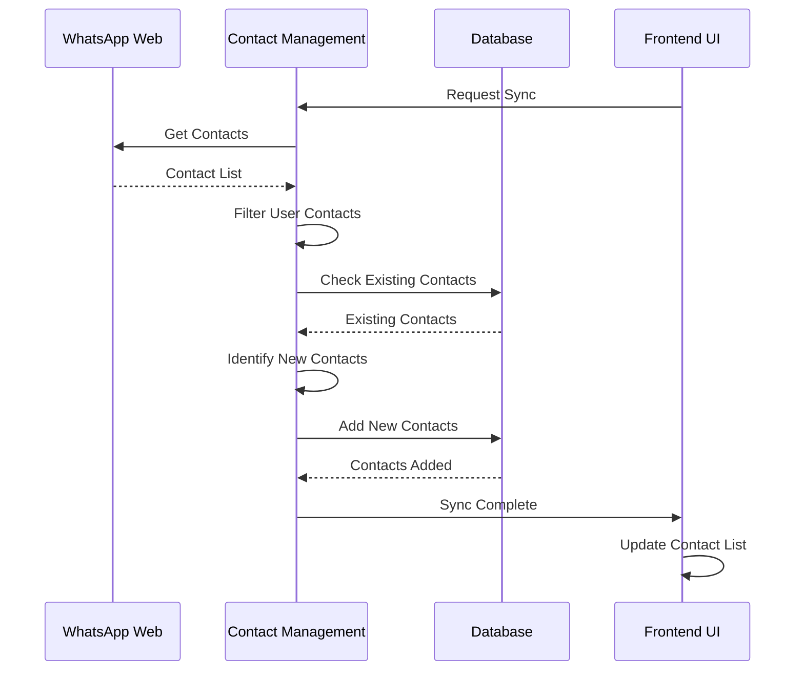

# Personal Edition Integration Points Map

## Overview

This document provides a comprehensive map of all integration points within the Personal edition of JStarReplyBot. It details how different services, components, and external systems interact with each other, providing a clear understanding of the system architecture and data flows.

## System Architecture Overview

### Core Components



## Backend Service Integration Points

### 1. Contact Management Service Integration

#### Internal Service Dependencies
```typescript
// Contact Management Service Dependencies
class ContactManagementService {
    // WhatsApp Client Integration
    private whatsappClient: WhatsAppClient
    
    // Database Integration
    private getSettings: () => Promise<Settings>
    private saveSettings: (settings: Settings) => Promise<void>
    
    // Mood Detection Integration (for sync)
    private moodDetectionService: MoodDetectionService
    
    // Personal Context Integration
    private personalContextService: PersonalContextService
}
```

#### External API Integration
- **WhatsApp Web API**: Contact synchronization and real-time updates
- **Database**: Settings storage and contact persistence
- **Logger**: Activity logging and debugging

#### IPC Channel Integration
```typescript
// Contact Management IPC Channels
export const CONTACT_IPC_CHANNELS = {
    GET_CONTACTS: 'contacts:get-all',
    ADD_CONTACT: 'contacts:add',
    UPDATE_CONTACT: 'contacts:update',
    DELETE_CONTACT: 'contacts:delete',
    ASSIGN_CATEGORIES: 'contacts:assign-categories',
    SEARCH_CONTACTS: 'contacts:search',
    IMPORT_CONTACTS: 'contacts:import',
    EXPORT_CONTACTS: 'contacts:export',
    GET_CONTACT_NOTES: 'contact-notes:get-all',
    ADD_CONTACT_NOTE: 'contact-notes:add',
    UPDATE_CONTACT_NOTE: 'contact-notes:update',
    DELETE_CONTACT_NOTE: 'contact-notes:delete'
}
```

### 2. Mood Detection Service Integration

#### Internal Service Dependencies
```typescript
// Mood Detection Service Dependencies
class MoodDetectionService {
    // Text Processing Integration
    private tokenizeText: (text: string) => string[]
    private calculateEmotionScores: (words: string[]) => Record<string, number>
    
    // Database Integration (for profiles)
    private getSettings: () => Promise<Settings>
    private saveSettings: (settings: Settings) => Promise<void>
}
```

#### External API Integration
- **Gemini API**: Text embedding for advanced mood analysis (future enhancement)
- **Database**: Mood profile storage and retrieval

#### IPC Channel Integration
```typescript
// Mood Detection IPC Channels
export const MOOD_IPC_CHANNELS = {
    DETECT_MOOD: 'mood:detect',
    GET_MOOD_PROFILE: 'mood:get-profile',
    UPDATE_MOOD_PROFILE: 'mood:update-profile',
    GET_RESPONSE_ADJUSTMENTS: 'mood:get-adjustments'
}
```

### 3. Analytics Service Integration

#### Internal Service Dependencies
```typescript
// Analytics Service Dependencies
class AnalyticsService {
    // Message Tracking Integration
    private messageHistory: MessageAnalytics[]
    
    // Database Integration
    private getSettings: () => Promise<Settings>
    private incrementStats: (stats: Partial<Stats>) => Promise<void>
    
    // Contact Management Integration
    private contactManagementService: ContactManagementService
    
    // Mood Detection Integration
    private moodDetectionService: MoodDetectionService
}
```

#### External API Integration
- **Database**: Analytics data storage and retrieval
- **File System**: Export functionality for JSON/CSV

#### IPC Channel Integration
```typescript
// Analytics IPC Channels
export const ANALYTICS_IPC_CHANNELS = {
    GET_ANALYTICS: 'analytics:get',
    EXPORT_ANALYTICS: 'analytics:export',
    TRACK_MESSAGE: 'analytics:track',
    GET_USAGE_METRICS: 'analytics:get-metrics'
}
```

### 4. Personal Context Service Integration

#### Internal Service Dependencies
```typescript
// Personal Context Service Dependencies
class PersonalContextService {
    // Contact Management Integration
    private contactManagementService: ContactManagementService
    
    // Mood Detection Integration
    private moodDetectionService: MoodDetectionService
    
    // Analytics Integration
    private analyticsService: AnalyticsService
    
    // Conversation Memory Integration
    private conversationMemoryService: ConversationMemoryService
}
```

#### External API Integration
- **Database**: Context data storage
- **Cache System**: Context caching for performance

#### IPC Channel Integration
```typescript
// Personal Context IPC Channels
export const CONTEXT_IPC_CHANNELS = {
    GET_PERSONAL_CONTEXT: 'context:get',
    ENRICH_PROMPT: 'context:enrich',
    CLEAR_CACHE: 'context:clear-cache',
    GET_CONTEXT_STATS: 'context:get-stats'
}
```

### 5. Conversation Memory Service Integration

#### Internal Service Dependencies
```typescript
// Conversation Memory Service Dependencies
class ConversationMemoryService {
    // Database Integration
    private getSettings: () => Promise<Settings>
    
    // AI Integration
    private getEmbedding: (text: string) => Promise<number[]>
}
```

#### External API Integration
- **LanceDB**: Vector storage for semantic memory
- **Gemini API**: Text embedding generation
- **File System**: Memory export functionality

#### IPC Channel Integration
```typescript
// Conversation Memory IPC Channels
export const MEMORY_IPC_CHANNELS = {
    EMBED_MESSAGE: 'memory:embed',
    RECALL_MEMORY: 'memory:recall',
    GET_RECENT_HISTORY: 'memory:get-history',
    FORGET_CONTACT: 'memory:forget-contact',
    PRUNE_MEMORY: 'memory:prune',
    EXPORT_MEMORY: 'memory:export'
}
```

## Frontend Integration Points

### 1. Settings Store Integration

#### State Management
```typescript
// Settings Store Integration
interface SettingsStore {
    settings: Settings
    isLoading: boolean
    error: string | null
    
    // Actions
    loadSettings: () => Promise<void>
    updateSettings: (updates: Partial<Settings>) => Promise<void>
    resetSettings: () => Promise<void>
}
```

#### Feature Gating Integration
```typescript
// Feature Gating Integration
function useFeatureGating() {
    const { settings } = useSettingsStore()
    const edition = settings?.edition || 'personal'
    
    return {
        smartQueue: isFeatureEnabled(edition, 'smartQueue'),
        ownerInterception: isFeatureEnabled(edition, 'ownerInterception'),
        personalNotes: isFeatureEnabled(edition, 'personalNotes'),
        contactCategories: isFeatureEnabled(edition, 'contactCategories'),
        moodDetection: isFeatureEnabled(edition, 'moodDetection'),
        personalAnalytics: isFeatureEnabled(edition, 'personalAnalytics'),
        // ... other features
    }
}
```

### 2. Component Integration

#### Contact Management Components
```typescript
// Contact Management Component Integration
function ContactManagementPanel() {
    const { personalNotes, contactCategories } = useFeatureGating()
    const { settings, updateSettings } = useSettingsStore()
    
    // Integration with Contact Management Service
    const handleAddContact = async (contactData) => {
        const result = await ipcRenderer.invoke('contacts:add', contactData)
        // Update local state
        updateSettings({ contacts: [...settings.contacts, result] })
    }
}
```

#### Mood Detection Components
```typescript
// Mood Detection Component Integration
function MoodDetectionPanel() {
    const { moodDetection } = useFeatureGating()
    const { settings, updateSettings } = useSettingsStore()
    
    // Integration with Mood Detection Service
    const handleDetectMood = async (message) => {
        const result = await ipcRenderer.invoke('mood:detect', message)
        // Update UI with results
        setMoodResult(result)
    }
}
```

#### Analytics Components
```typescript
// Analytics Component Integration
function AnalyticsDashboard() {
    const { personalAnalytics } = useFeatureGating()
    const [analyticsData, setAnalyticsData] = useState(null)
    
    // Integration with Analytics Service
    useEffect(() => {
        const fetchAnalytics = async () => {
            const data = await ipcRenderer.invoke('analytics:get')
            setAnalyticsData(data)
        }
        fetchAnalytics()
    }, [])
}
```

## Database Integration Points

### 1. Settings Database Schema

```typescript
// Settings Database Integration
interface DatabaseSchema {
    // Core Settings
    draftMode: boolean
    ignoreGroups: boolean
    ignoreStatuses: boolean
    unsavedContactsOnly: boolean
    
    // Personal Edition Features
    personalNotes: PersonalNote[]
    contactCategories: ContactCategory[]
    moodDetection: MoodDetectionConfig
    personalAnalytics: AnalyticsConfig
    
    // Contact Management
    contacts: Contact[]
    contactNotes: ContactNote[]
    
    // Application Edition
    edition: 'personal' | 'business' | 'dev'
    
    // System Data
    lastContactSync: number
    stats: Stats
    licenseStatus: string
    licenseKey: string
}
```

### 2. Data Relationships



### 3. Database Operations

```typescript
// Database Integration Points
interface DatabaseOperations {
    // Settings Operations
    getSettings: () => Promise<Settings>
    saveSettings: (settings: Settings) => Promise<void>
    updateSettings: (updates: Partial<Settings>) => Promise<void>
    
    // Contact Operations
    getContacts: () => Promise<Contact[]>
    addContact: (contact: Contact) => Promise<void>
    updateContact: (contact: Contact) => Promise<void>
    deleteContact: (contactId: string) => Promise<void>
    
    // Note Operations
    getContactNotes: (contactId: string) => Promise<ContactNote[]>
    addContactNote: (note: ContactNote) => Promise<void>
    updateContactNote: (note: ContactNote) => Promise<void>
    deleteContactNote: (noteId: string) => Promise<void>
    
    // Category Operations
    getContactCategories: () => Promise<ContactCategory[]>
    addContactCategory: (category: ContactCategory) => Promise<void>
    updateContactCategory: (category: ContactCategory) => Promise<void>
    deleteContactCategory: (categoryId: string) => Promise<void>
    
    // Analytics Operations
    getAnalytics: () => Promise<AnalyticsData>
    trackMessage: (event: MessageAnalytics) => Promise<void>
    exportAnalytics: (format: 'json' | 'csv') => Promise<string>
}
```

## External API Integration Points

### 1. WhatsApp Web Integration

```typescript
// WhatsApp Web Integration Points
interface WhatsAppIntegration {
    // Connection Management
    connect: () => Promise<void>
    disconnect: () => Promise<void>
    getStatus: () => ConnectionStatus
    
    // Message Handling
    onMessage: (callback: (message: WhatsAppMessage) => void) => void
    sendMessage: (contactId: string, message: string) => Promise<void>
    
    // Contact Management
    getContacts: () => Promise<WhatsAppContact[]>
    onContactUpdate: (callback: (contact: WhatsAppContact) => void) => void
    
    // QR Code Handling
    getQRCode: () => Promise<string>
    onQRCode: (callback: (qrCode: string) => void) => void
    onAuthenticated: (callback: () => void) => void
}
```

### 2. Gemini API Integration

```typescript
// Gemini API Integration Points
interface GeminiIntegration {
    // Text Embedding
    getEmbedding: (text: string) => Promise<number[]>
    
    // AI Response Generation
    generateResponse: (prompt: string, context?: string[]) => Promise<string>
    
    // Model Configuration
    setModel: (model: string) => void
    getModel: () => string
    
    // Rate Limiting
    isRateLimited: () => boolean
    getRateLimitStatus: () => RateLimitStatus
}
```

### 3. LanceDB Integration

```typescript
// LanceDB Integration Points
interface LanceDBIntegration {
    // Database Management
    connect: (path: string) => Promise<void>
    createTable: (tableName: string, schema: any) => Promise<void>
    openTable: (tableName: string) => Promise<any>
    
    // Vector Operations
    add: (tableName: string, records: any[]) => Promise<void>
    search: (tableName: string, queryVector: number[], topK: number) => Promise<any[]>
    delete: (tableName: string, condition: string) => Promise<void>
    
    // Table Management
    dropTable: (tableName: string) => Promise<void>
    listTables: () => Promise<string[]>
    getTableSchema: (tableName: string) => Promise<any>
}
```

## Data Flow Integration Points

### 1. Message Processing Flow



### 2. Settings Management Flow



### 3. Contact Synchronization Flow



## Error Handling Integration Points

### 1. Service Error Handling

```typescript
// Service Error Handling Integration
interface ServiceErrorHandling {
    // Error Propagation
    handleServiceError: (service: string, error: Error) => void
    
    // Graceful Degradation
    enableGracefulDegradation: (service: string) => void
    disableGracefulDegradation: (service: string) => void
    
    // Error Recovery
    attemptServiceRecovery: (service: string) => Promise<boolean>
    getServiceHealth: (service: string) => ServiceHealthStatus
}
```

### 2. Database Error Handling

```typescript
// Database Error Handling Integration
interface DatabaseErrorHandling {
    // Connection Errors
    handleConnectionError: (error: Error) => void
    
    // Transaction Errors
    handleTransactionError: (error: Error) => void
    
    // Data Integrity Errors
    handleDataIntegrityError: (error: Error) => void
    
    // Recovery Mechanisms
    attemptDatabaseRecovery: () => Promise<boolean>
    createDatabaseBackup: () => Promise<string>
    restoreDatabaseBackup: (backupPath: string) => Promise<void>
}
```

### 3. External API Error Handling

```typescript
// External API Error Handling Integration
interface APIErrorHandling {
    // Rate Limiting
    handleRateLimit: (api: string, error: Error) => void
    
    // Network Errors
    handleNetworkError: (api: string, error: Error) => void
    
    // Authentication Errors
    handleAuthError: (api: string, error: Error) => void
    
    // Fallback Mechanisms
    enableAPIFallback: (api: string) => void
    disableAPIFallback: (api: string) => void
}
```

## Performance Monitoring Integration Points

### 1. Service Performance Monitoring

```typescript
// Service Performance Monitoring
interface PerformanceMonitoring {
    // Response Time Tracking
    trackServiceResponseTime: (service: string, operation: string, duration: number) => void
    
    // Memory Usage Tracking
    trackServiceMemoryUsage: (service: string, memoryUsage: number) => void
    
    // Error Rate Tracking
    trackServiceErrorRate: (service: string, errorCount: number) => void
    
    // Performance Metrics
    getServiceMetrics: (service: string) => ServiceMetrics
    getSystemMetrics: () => SystemMetrics
}
```

### 2. Database Performance Monitoring

```typescript
// Database Performance Monitoring
interface DatabasePerformanceMonitoring {
    // Query Performance
    trackQueryPerformance: (query: string, duration: number) => void
    
    // Connection Pool Monitoring
    trackConnectionPool: (active: number, idle: number, total: number) => void
    
    // Storage Performance
    trackStoragePerformance: (operation: string, duration: number, size: number) => void
    
    // Database Health
    getDatabaseHealth: () => DatabaseHealthStatus
    getQueryStatistics: () => QueryStatistics
}
```

### 3. API Performance Monitoring

```typescript
// API Performance Monitoring
interface APIPerformanceMonitoring {
    // Request Tracking
    trackAPIRequest: (api: string, endpoint: string, duration: number) => void
    
    // Response Quality
    trackAPIResponseQuality: (api: string, quality: number) => void
    
    // Rate Limit Monitoring
    trackAPIRateLimit: (api: string, current: number, limit: number) => void
    
    // API Health
    getAPIHealth: (api: string) => APIHealthStatus
    getAPIStatistics: (api: string) => APIStatistics
}
```

This comprehensive integration points map provides a detailed understanding of how all components in the Personal edition of JStarReplyBot work together, enabling effective testing, debugging, and system maintenance.