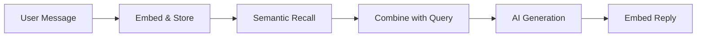

# Feature: Conversation Memory (Per-Contact RAG)

## Overview
Conversation Memory provides per-contact semantic memory using LanceDB vector storage. Each contact has an isolated memory store, allowing the AI to recall past conversations and provide contextual replies.

## Architecture
- **Service:** `src/main/services/conversation-memory.service.ts`
- **Storage:** LanceDB (per-contact tables in `data/memory/`)
- **Embeddings:** Google Gemini `text-embedding-004`
- **Integration:** `src/main/whatsapp.ts`, `src/main/ai-engine.ts`

## Key Components

### 1. Memory Service
Provides core memory operations:
- `embedMessage(contactId, role, text, metadata?)` → Stores message with vector embedding
- `recallMemory(contactId, query, k?)` → Semantic search for relevant past messages
- `getRecentHistory(contactId, limit?)` → Chronological recent messages

### 2. Memory Record Schema
```typescript
interface ConversationMemoryRecord {
  id: string;
  contactId: string;
  role: 'user' | 'assistant' | 'owner';
  text: string;
  timestamp: number;
  multimodalContext?: string;
  vector: number[]; // 768-dim embedding
}
```

### 3. Context Injection
The AI prompt includes recalled memories:
```
--- CONVERSATION HISTORY ---
User: "How much is the wedding package?"
You: "Our wedding package starts at ₦500,000..."
--- END HISTORY ---
```

## Data Flow


## Feature Flags
| Edition | Memory Enabled |
|---------|----------------|
| Personal | ✅ |
| Business | ✅ |
| Dev | ✅ |

## Configuration

| Setting | Type | Default | Description |
|---------|------|---------|-------------|
| `conversationMemory.enabled` | `boolean` | `true` | Enable/disable memory |
| `conversationMemory.maxMessagesPerContact` | `number` | `500` | Max messages before pruning |
| `conversationMemory.ttlDays` | `number` | `30` | Days before automatic cleanup (0 = infinite) |

## Technical Notes

### Per-Contact Isolation
Each contact gets a separate LanceDB table (`contact_{id}`). This prevents data leakage between conversations.

### Hybrid Recall
The system uses both:
1. **Semantic Search:** Find messages similar to current query
2. **Recent History:** Last N messages for continuity

### Owner Messages
When the owner sends a message (detected via `msg.fromMe`), it's stored with `role: 'owner'`. This enables:
- Style learning from owner's actual replies
- Context for collaborative mode

## Changelog

### 2025-12-25: Initial Implementation
- Created `conversation-memory.service.ts`
- Integrated with `whatsapp.ts` for auto-embedding
- Added `role: 'owner'` support for style learning
- Gated behind `features.memory.enabled`

## Future Enhancements
- [x] **Settings UI Toggle:** Add memory enable/disable toggle in Settings
- [x] **"Forget Me" Button:** Per-contact button to wipe their memory (GDPR-friendly)
- [x] **Memory Export:** Export contact's conversation history as JSON *(Dev only)*
- [x] **Selective Pruning:** Delete messages older than X days per contact *(All tiers)*

