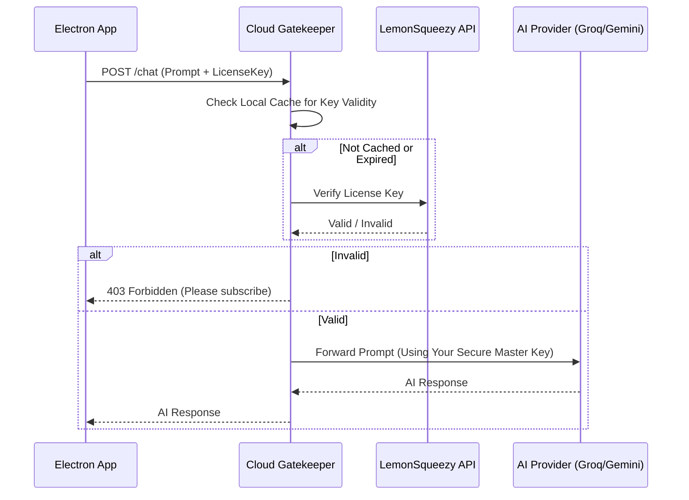

# Feature: Licensing, Usage Monitoring & API Key Orchestration

## Goal
To implement a centralized system that controls user access to the JStarReplyBot (Licensing), tracks their activity (Usage Monitoring), and securely manages/rotates AI Provider Keys (API Key Orchestration) so the end-user never needs to provide or see a raw API key.

## Architecture Proposal: The "Proxy & Pivot" Model

Since user's machines are untrusted environments, we cannot embed your master API keys directly into the Electron app (they could be reverse-engineered). Instead, we introduce a **Cloud Gatekeeper** (likely a lightweight Next.js or Node.js server).

### 1. The Components

*   **The Client (JStarReplyBot):**
    *   User logs in with a **License Key** (e.g., `JSTAR-XXXX-YYYY`).
    *   Client sends prompts to `https://api.jstar-gatekeeper.com/chat`.
    *   Header: `Authorization: Bearer <LicenseKey>`

*   **The Gatekeeper (Your Dashboard/Server):**
    *   **Auth Layer:** Verifies if License Key is valid, active, and has remaining credits.
    *   **Orchestrator Layer:**
        *   Maintains a pool of your "Master Keys" (Groq, Gemini, OpenAI).
        *   Implements **Key Rotation**: Picks the next key in the list to spread load.
        *   Implements **Failover**: If Key A hits a rate limit, instantly retry with Key B.
    *   **Monitoring Layer:** Logs the request (User ID, Token Count, Timestamp).

### 2. Usage Monitoring & Live Dashboard
We track usage at the Gatekeeper level.
*   **Metrics:** Daily Active Users (DAU), Tokens Consumed per User, Error Rates.
*   **Enforcement:** If a user exceeds their tier limits (e.g., 1000 messages/month), the Gatekeeper rejects the request with `402 Payment Required`.
*   **Live Dashboard (Implemented):**
    *   **Real-time Feed:** In-memory logging of the last 50 requests (type, latency, status).
    *   **Stats:** Live Success Rate %, Total Requests, and Failure counters.
    *   **Privacy:** Logs are ephemeral (reset on restart) and anonymized (no full message content).
    *   **Visuals:** Premium "Cyber-Grid" aesthetic with glassmorphism UI.

### 3. API Key Management (The "Rotation")
*   **Database:** You store an array of keys: `[{ provider: 'groq', key: 'gsk_1...', status: 'active' }, { provider: 'gemini', key: 'AIza...', status: 'active' }]`.
*   **Logic:**
    *   *Round Robin:* Request 1 -> Key A, Request 2 -> Key B.
    *   *Smart Routing:* Use cheap keys (Gemini Flash) for simple replies, expensive keys (Llama 70b) for complex ones.

## Integration with Payment Providers (Gumroad/LemonSqueezy)

The `00_Notes/Idea.md` correctly identified **Gumroad** or **LemonSqueezy** as the billing engine.

*   **The Workflow:**
    1.  User buys "Pro Plan" on your LemonSqueezy checkout page.
    2.  LemonSqueezy generates a **License Key** (e.g., `5A82-....`).
    3.  **Gatekeeper Validation:** When the user hits your Gatekeeper `/chat` endpoint, the Gatekeeper validates the key against the LemonSqueezy API.
        *   *Optimization:* Cache the validation result in your DB so we don't hit LemonSqueezy API on every single chat message. Re-validate every 24 hours.

## Why the "Gatekeeper" is Mandatory (Security Note)

Your notes mentioned the app calling Vercel AI SDK directly.
*   **Risk:** If the Electron app calls OpenAI/Groq directly, **Your Master API Key** must be inside the Electron app code.
*   **Danger:** A hacker can extract that key in 5 minutes and use your credit card to run their own bot farm.
*   **Solution:** The **Gatekeeper** is the *only* thing that knows your Master Keys. The Electron app only knows the User's License Key. This is the industry standard for secure desktop apps interacting with paid APIs.

## Data Flow Diagram (Updated)

## User Experience

1.  **Onboarding:** Customer buys a specific tier on your website -> Receives a License Key via email.
2.  **Login:** Customer enters License Key into JStarReplyBot Settings.
3.  **Daily Use:** It "just works". No API key setup for them.
4.  **Expiry:** App notifies "License Expired" if the Gatekeeper returns a 403.

## Technical Requirements

1.  **Backend:** A small Serverless function (Next.js API Routes are perfect for this) or a dedicated Node server.
2.  **Database:** Supabase (easiest for Auth + Row Level Security) or Firebase.
3.  **Encryption:** API Keys stored encrypted in the DB.

## Questions for You
1.  Do you already have a server/hosting preference (Vercel, VPS, etc.)?
2.  Do you want a simple "One License = Unlimited" model, or a "Credits/Tokens" model?
3.  Are we building this Dashboard now, or just the hookups in the Electron app?
