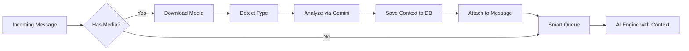

# Multimodal Processing (Vision, Audio, Video)

## Overview
JStarReplyBot supports multimodal inputs: **Images, Voice Notes, and Videos**. When a user sends media, it is analyzed via Google Gemini before being passed to the main AI (Groq/OpenRouter) for reply generation.

## Architecture
- **Service:** `src/main/services/multimodal.service.ts`
- **AI Provider:** Gemini 2.5 Flash Lite (multimodal)
- **Storage:** `db.ts` → `saveMessageContext()` / `getMessageContext()` for persisting analysis across chat history

## Supported Media Types

| Type       | Trigger Condition                          | Setting Toggle        |
|------------|--------------------------------------------|-----------------------|
| Audio      | `mimetype.includes('audio')` or `'ogg'`    | `voiceEnabled`        |
| Image      | `mimetype.includes('image')` or `'sticker'`| `visionEnabled`       |
| Video      | `mimetype.includes('video')`               | `visionEnabled`       |

## Processing Pipeline



## Key APIs

### `analyzeMedia(mode, base64Data, mimeType): Promise<string | null>`
Sends media to Gemini for analysis. Returns a text description/transcription.

**Routing:**
- **Licensed (Gatekeeper):** Proxies through `GATEKEEPER_URL/chat`.
- **Unlicensed (Local):** Falls back to local `@ai-sdk/google` with `GEMINI_API_KEY`.

---

## Intent-Aware Image Analysis (Hotfix 2025-12-25)

### Problem
The original image prompt was:
```
"Describe the content of this image naturally..."
```
This caused the AI to literally describe memes like "a person wearing a durag and glasses with airpods" instead of understanding the **intent** (e.g., "this is a relatable mood meme shared for humor").

**Result:** The bot would reply with awkward literal descriptions instead of vibing with the joke.

### Solution: Structured Intent Analysis
The image prompt was rewritten to focus on **WHY** the image was shared, not just **WHAT** is in it:

```typescript
// src/main/services/multimodal.service.ts (lines 39-53)
prompt = `Analyze this image for conversational context...

First, identify the IMAGE TYPE:
- MEME: A joke/relatable image shared for humor or mood
- PRODUCT: A product photo or screenshot
- SCREENSHOT: A screenshot of text/conversation/app
- SELFIE: A personal photo
- OTHER: Anything else

Then provide:
1. [TYPE]: One of the above
2. [INTENT]: Why was this shared? (e.g., "sharing a joke", "asking about availability")
3. [CONTEXT]: If it's a meme/joke, what's the humor? If it's a product, what is it?

Be concise. Focus on INTENT over literal visual description.`
```

### AI Engine Context Injection
The main AI model (`ai-engine.ts`) now receives explicit instructions on how to react:

```typescript
// src/main/ai-engine.ts (lines 66-72)
--- MEDIA CONTEXT ---
The user shared media. Here is the analysis:
[TYPE]: MEME
[INTENT]: Sharing a relatable joke about being tired
[CONTEXT]: Meme shows a person looking exhausted, text says "me after debugging for 8 hours"

RESPOND BASED ON THE [TYPE] AND [INTENT]:
- MEME: React to the humor/mood, don't describe the image. Just vibe with it.
- PRODUCT: Answer questions about the product naturally.
- SCREENSHOT: Respond to the content shown.
- SELFIE: Compliment or engage naturally.
--- END MEDIA CONTEXT ---
```

### Result
The bot now correctly interprets memes as jokes and **vibes** instead of going into "computer vision mode".

---

## Conversation History with Multimodal Context

When fetching chat history (`whatsapp.ts`), the bot retrieves persisted multimodal contexts:

```typescript
// src/main/whatsapp.ts (lines 256-261)
const context = await getMessageContext(m.id._serialized)
const role = m.fromMe ? 'model' : 'user'
const content = context ? `${m.body}\n[Context: ${context}]` : m.body
```

This ensures the AI remembers that a previous message was an image/voice note even in multi-turn conversations.

---

## Configuration

| Setting        | Type    | Default | Description                          |
|----------------|---------|---------|--------------------------------------|
| `voiceEnabled` | boolean | `true`  | Enable voice note transcription      |
| `visionEnabled`| boolean | `true`  | Enable image/video analysis          |

---

## Logging & Debugging (2025-12-25)

Multimodal analysis now logs the **full AI description** for debugging:

```
[AI] [Multimodal] IMAGE Analysis Result:
[TYPE]: MEME
[INTENT]: sharing a joke about being tired
[CONTEXT]: Meme shows a person looking exhausted...
```

Check the **Logs** tab in the app to see complete media descriptions. This helps debug cases where the AI misinterprets media intent.

---

## Dependencies
- `@ai-sdk/google` (Local Gemini)
- `@google/generative-ai` (Embeddings)
- Gatekeeper `/chat` endpoint (Licensed users)

