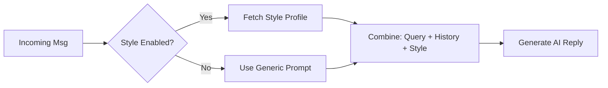

# Feature: Style Learning & Persona Adaptation

## Overview
The Style Learning system enables the bot to mimic the owner's unique voice, vocabulary, and relationship dynamics. Instead of sounding like a generic AI, it dynamically adapts its tone based on who it is talking to (e.g., casual/slang with friends, formal with business contacts).

## Architecture
- **Service:** `src/main/services/style-profile.service.ts`
- **Integration:** `src/main/whatsapp.ts`
- **Configuration:** `src/shared/config/features.ts`

## Key Components

### 1. Style Profile Service
Analyzes past conversation history to build a "Style Profile" for the user.
- **Global Style:** The user's baseline speaking habits (abbreviations, capitalization, emoji usage).
- **Relational Context:** How the user speaks *specifically* to this contact.

### 2. Context Injection (`whatsapp.ts`)
Before generating a reply, the system:
1.  Fetches the `styleContext` string from the service.
2.  Injects this context into the AI System Prompt.
3.  Instructs the LLM to "Rewrite the response to match this style."

### 3. Feature Flags
Style Learning is a premium feature controlled by `FEATURE_DEFAULTS`:
- **Personal Edition:** Disabled (Generic AI tone).
- **Pro/Creator Edition:** Enabled (Full style adaptation).

## Data Flow

## Future Enhancements
- **Automatic Learning:** Scheduled jobs to periodic re-analyze chat history.
- **Manual Overrides:** UI for user to define "Always be formal with X".
