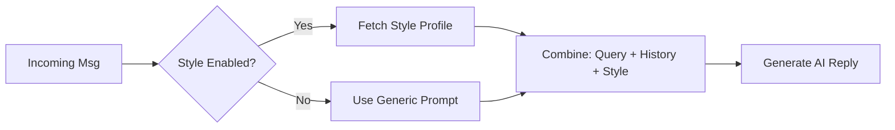

# Feature: Style Learning & Persona Adaptation

## Overview
The Style Learning system enables the bot to mimic the owner's unique voice, vocabulary, and relationship dynamics. Instead of sounding like a generic AI, it dynamically adapts its tone based on who it is talking to (e.g., casual/slang with friends, formal with business contacts).

## Architecture
- **Services:**
  - `src/main/services/style-profile.service.ts` (CRUD for style data)
  - `src/main/services/style-extractor.service.ts` (pattern analysis)
- **Integration:** `src/main/whatsapp.ts`, `src/main/ai-engine.ts`
- **UI:** `src/renderer/src/components/settings/StyleMemoryPanel.tsx`, `StyleOnboarding.tsx`
- **Configuration:** `src/shared/config/features.ts`

## Key Components

### 1. Style Profile Service
Manages the user's style profile stored in LowDB:
- **Global Style:** Vocabulary, banned phrases, emoji usage, sentence length, sample messages.
- **Per-Chat Overrides:** Relationship context, specific vocabulary for individual contacts.

### 2. Style Extractor Service
Analyzes owner messages to detect patterns:
- `extractVocabulary(messages)` → Top 20 frequently used words
- `analyzeEmojiUsage(messages)` → `none | light | moderate | heavy`
- `analyzeSentenceStyle(messages)` → `short | medium | long`
- `detectPatterns(messages)` → Combined patterns object

### 3. Context Injection (`ai-engine.ts`)
The AI prompt is enriched with style instructions:
```
--- STYLE INSTRUCTIONS (OWNER VOICE) ---
Vocabulary: Use these words if natural: [lol, na, sha, abeg]
Sentence Style: short length sentences.
Emoji Usage: Use moderate emojis.
Ends with Period: NO (drop final period).
Sample Messages (Mimic this vibe):
"On my way!"
"No wahala, talk soon"
--- END STYLE INSTRUCTIONS ---
```

### 4. UI Components

#### StyleMemoryPanel
Displays learned patterns with ability to:
- View detected emoji usage, sentence style
- See and delete learned vocabulary
- View sample messages

#### StyleOnboarding Wizard
Manual setup for new users (accessed via "Tune Style" button):
- Step 1: Select emoji level & sentence length
- Step 2: Paste 3 sample messages
- Saves directly to StyleProfile

### 5. Feature Flags
Style Learning is controlled by `FEATURE_DEFAULTS`:
| Edition | Style Learning |
|---------|----------------|
| Personal | ✅ Enabled |
| Business | ❌ Disabled |
| Dev | ✅ Enabled |

## Data Flow


## IPC Channels

| Channel | Purpose |
|---------|---------|
| `style:get` | Fetch full StyleProfile |
| `style:update` | Update global or per-chat style |
| `style:delete-item` | Remove vocabulary or sample |

## Configuration

| Setting | Type | Default | Description |
|---------|------|---------|-------------|
| `edition` | `string` | `'personal'` | Must be `personal` or `dev` for style to work |

## Changelog

### 2025-12-25: Full Implementation
- Created `StyleProfileService` and `StyleExtractorService`
- Integrated style context into `ai-engine.ts`
- Built `StyleMemoryPanel` UI with delete functionality
- Added `StyleOnboarding` wizard for manual setup
- Gated behind `features.styleLearning` flag

## Future Enhancements
- **Automatic Learning:** Scheduled jobs to periodically re-analyze chat history.
- **Manual Overrides:** UI for user to define "Always be formal with X".
- **Per-Chat Profiles:** Full UI for managing per-contact style overrides.
