# Personal Edition Logic Flow Diagrams

## Overview

This document contains detailed logic flow diagrams for all Personal edition features in JStarReplyBot. These diagrams provide visual representations of how each feature works, the decision points, and the data flow between components.

## Contact Management Flow Diagrams

### 1. Contact Creation and Management Flow

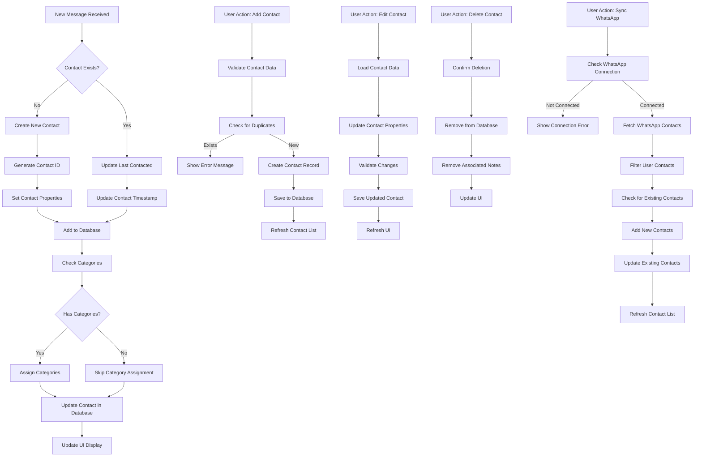

### 2. Contact Categorization Flow

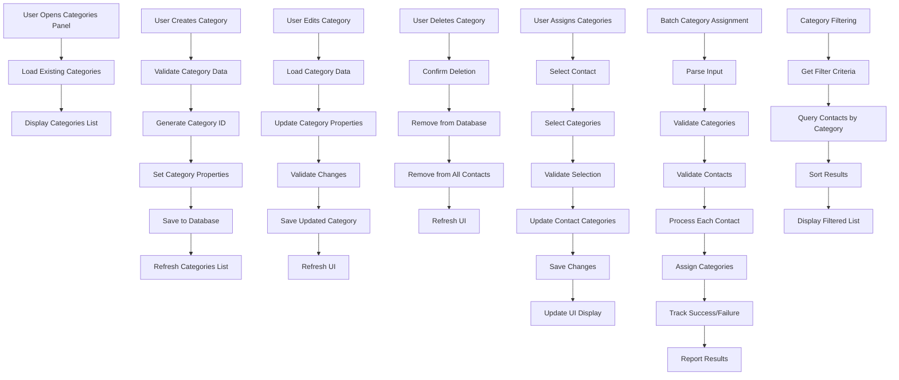

### 3. Contact Notes Management Flow

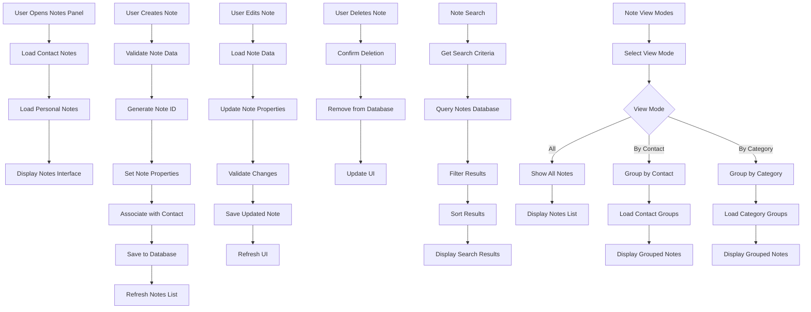

## Mood Detection Flow Diagrams

### 1. Mood Detection Processing Flow

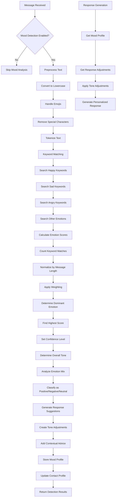

### 2. Mood-Based Response Adjustment Flow

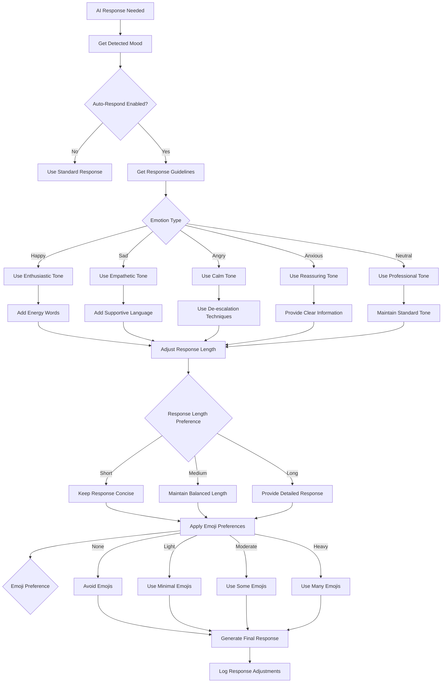

### 3. Mood Profile Management Flow

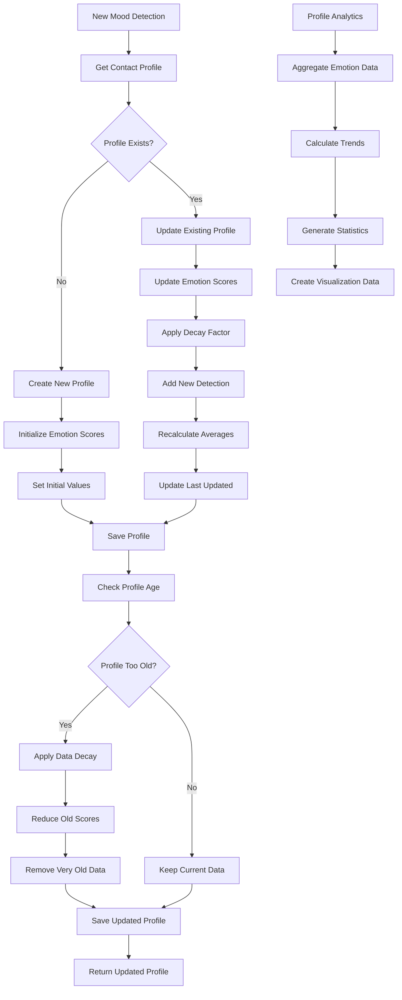

## Analytics Flow Diagrams

### 1. Analytics Data Collection Flow

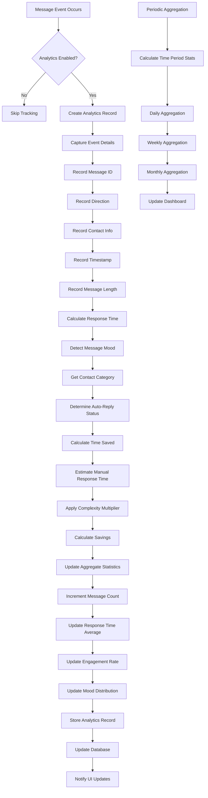

### 2. Analytics Export Flow

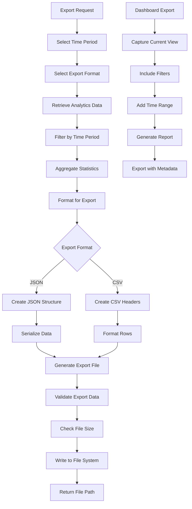

### 3. Analytics Display Flow

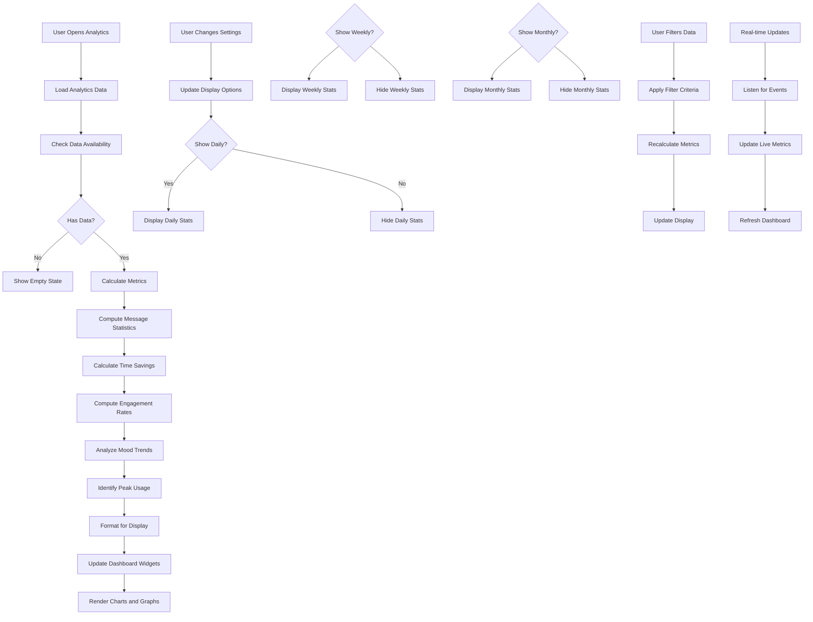

## Personal Context Flow Diagrams

### 1. Context Enrichment Flow

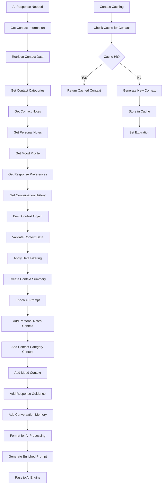

### 2. Context Caching Flow

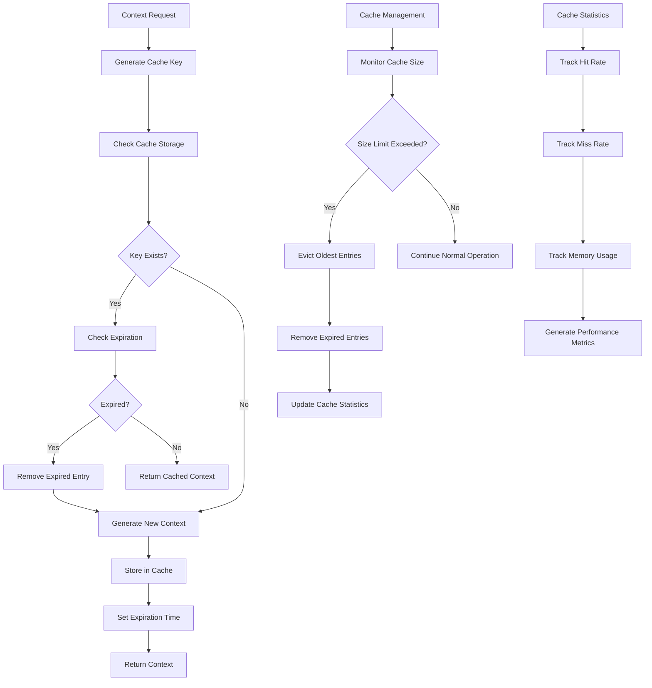

### 3. Response Personalization Flow

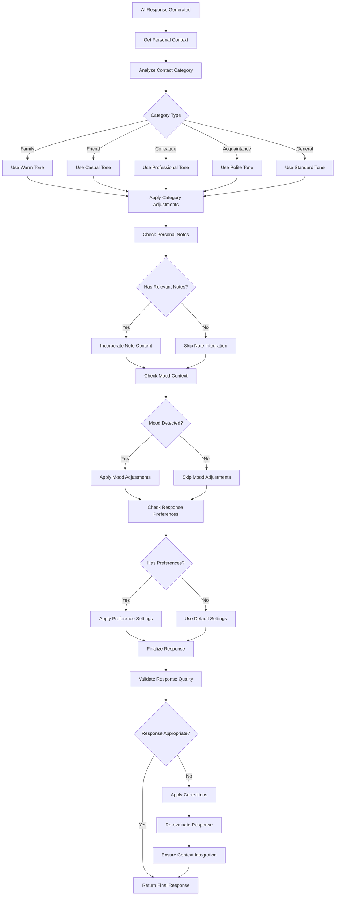

## Conversation Memory Flow Diagrams

### 1. Memory Storage Flow

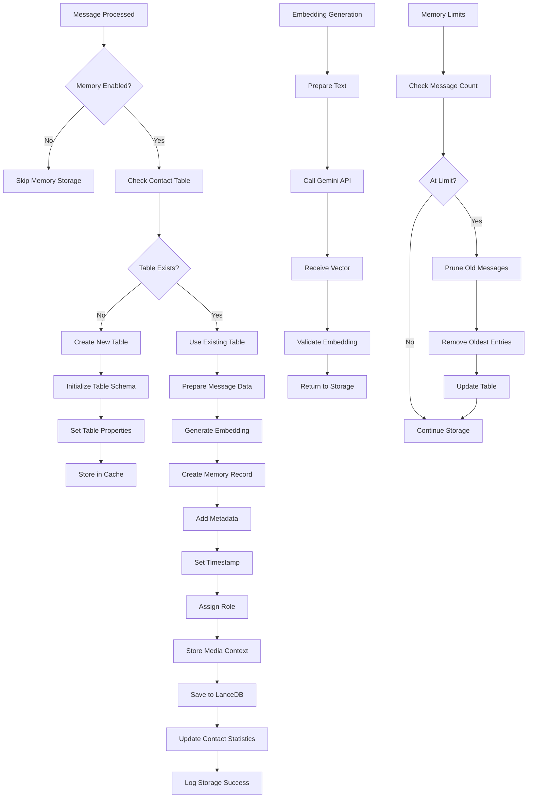

### 2. Memory Recall Flow

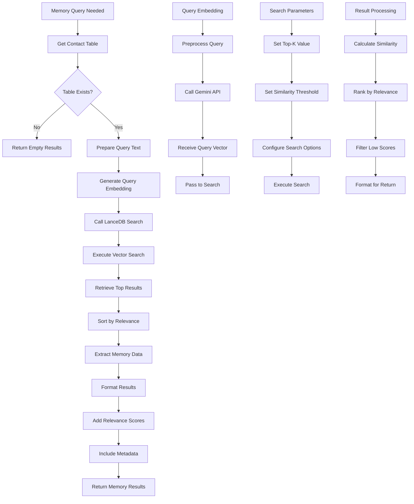

### 3. Memory Management Flow

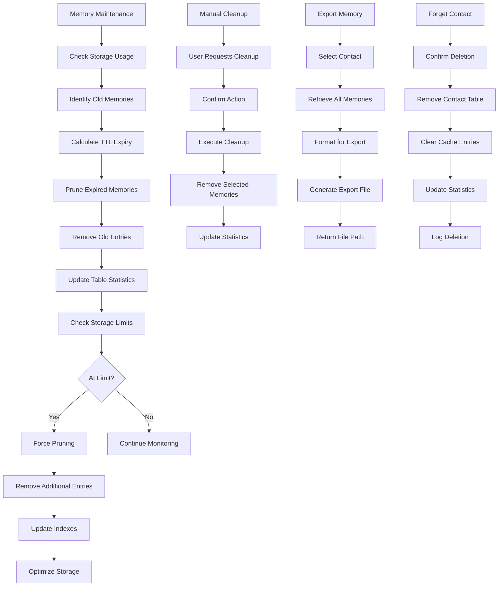

## Integration Flow Diagrams

### 1. Feature Interoperability Flow

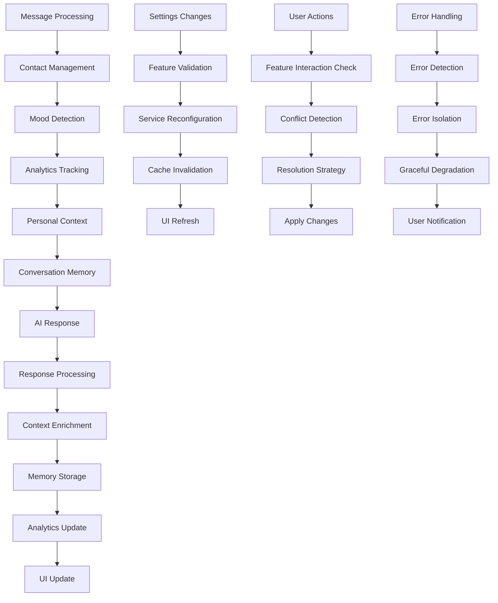

### 2. Data Flow Architecture

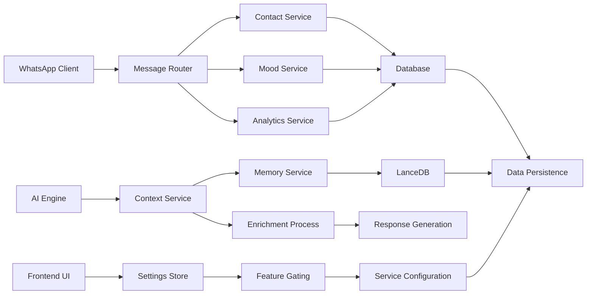

### 3. Error Recovery Flow

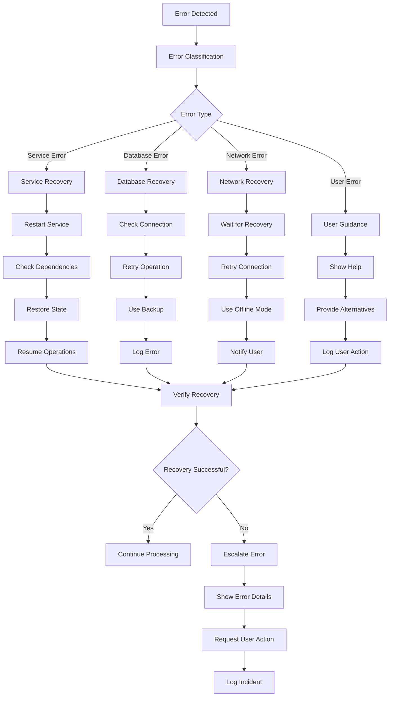

These flow diagrams provide comprehensive visual representations of how each Personal edition feature works, the decision points involved, and how the features interact with each other. They serve as valuable references for understanding the system architecture and for debugging issues that may arise during testing or production use.