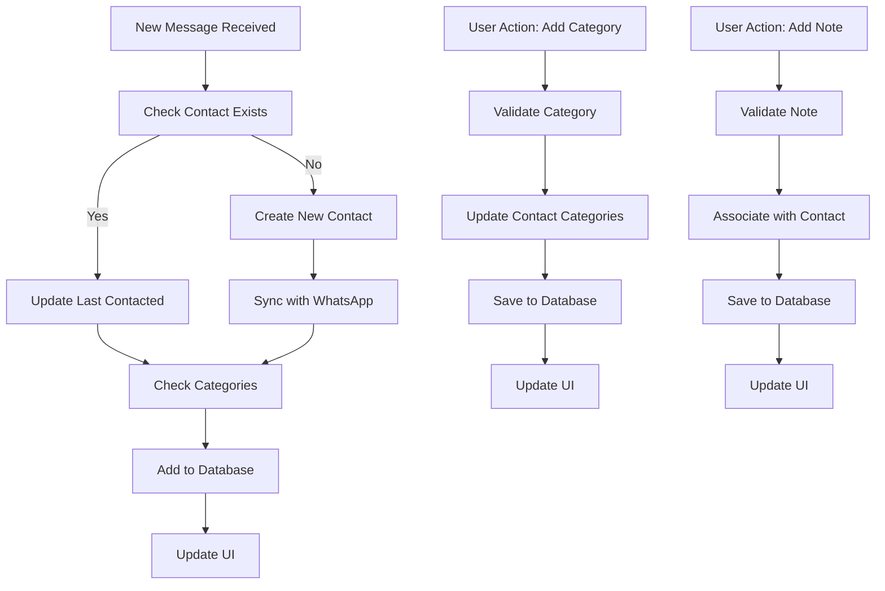
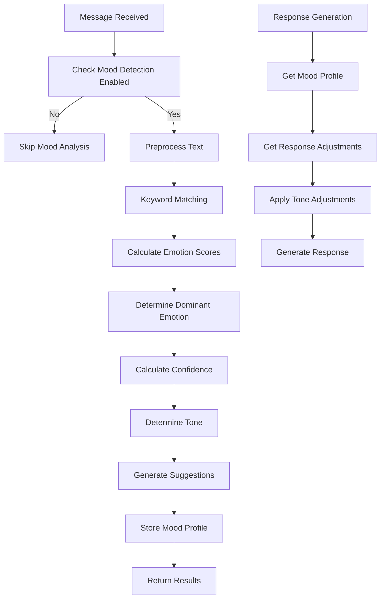
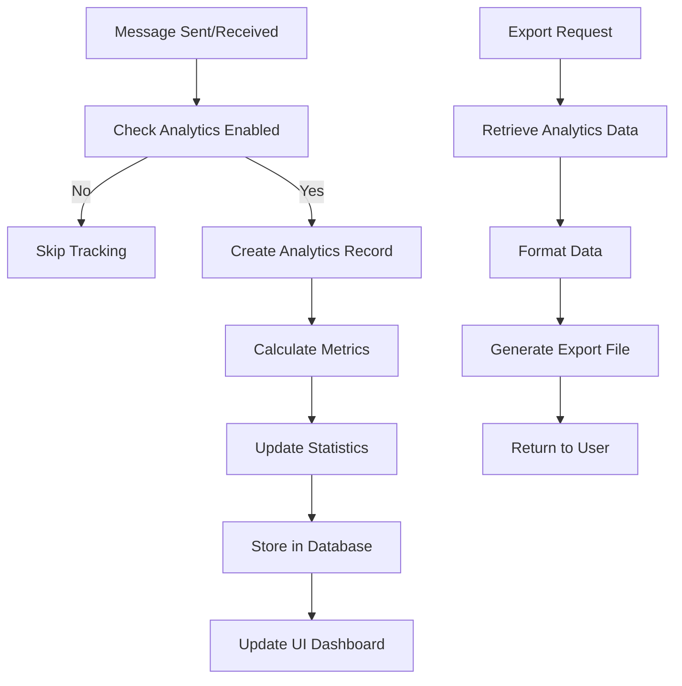
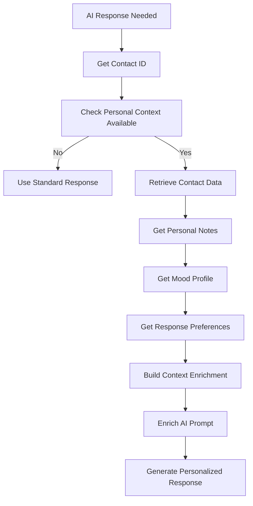
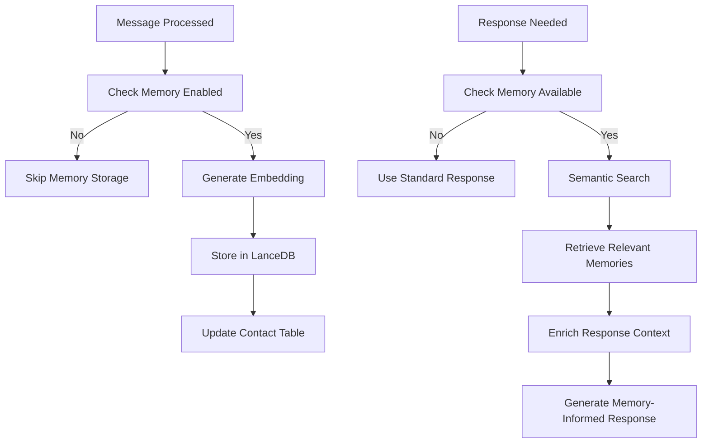
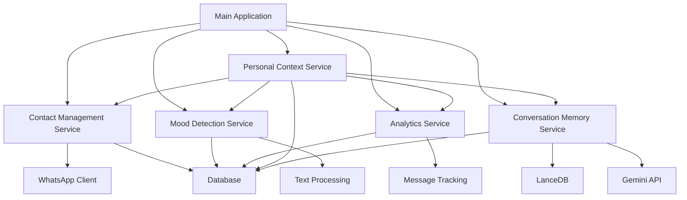
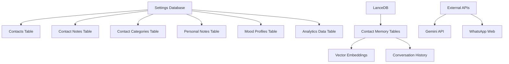
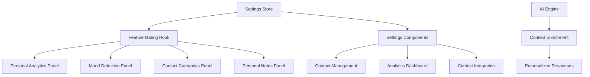
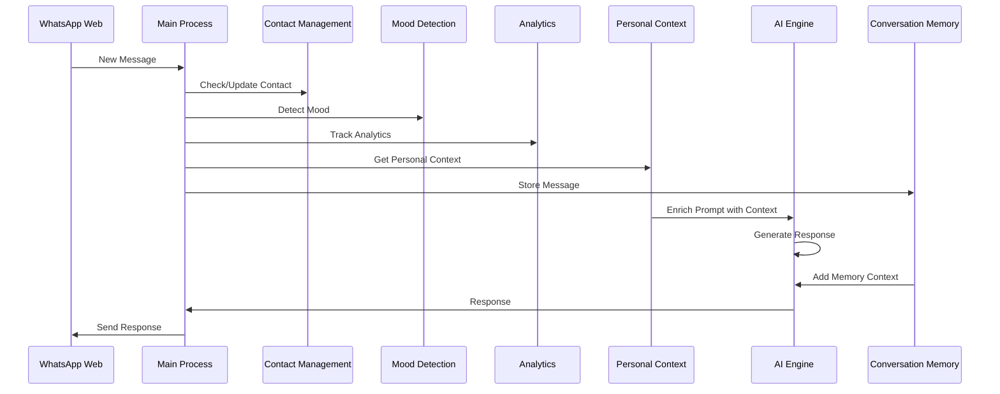
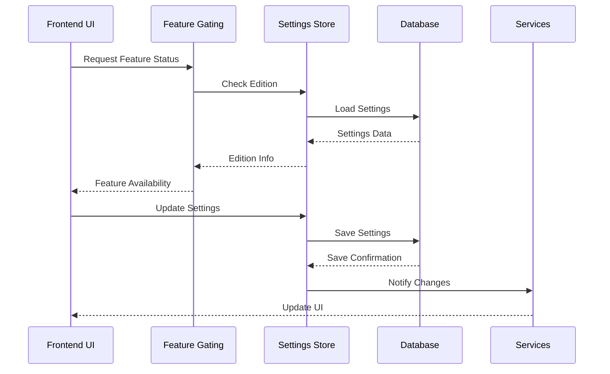

# Personal Edition Verification Guide

## Overview

This comprehensive verification guide provides another agent with all the information needed to systematically test and validate the Personal edition features of JStarReplyBot. The guide includes technical implementation details, logic flow diagrams, test scenarios, integration points, expected behavior, and troubleshooting information.

## Table of Contents

1. [Technical Implementation Guide](#technical-implementation-guide)
2. [Logic Flow Diagrams](#logic-flow-diagrams)
3. [Test Scenarios](#test-scenarios)
4. [Integration Points Map](#integration-points-map)
5. [Expected Behavior Documentation](#expected-behavior-documentation)
6. [Common Issues and Solutions](#common-issues-and-solutions)
7. [Verification Checklist](#verification-checklist)
8. [Quick Start Verification](#quick-start-verification)

---

## Technical Implementation Guide

### Backend Services Architecture

#### 1. Contact Management Service (`contact-management.service.ts`)

**Purpose**: Manages all contact-related operations including CRUD operations, categorization, and notes.

**Key Components**:
- Singleton pattern implementation
- Integration with WhatsApp client for contact synchronization
- Support for test data generation
- Batch operations for efficiency
- Search and filtering capabilities

**Core Methods**:
```typescript
// Contact Operations
getContacts(): Promise<Contact[]>
addContact(contactData): Promise<Contact>
updateContact(id, updates): Promise<Contact | null>
deleteContact(id): Promise<boolean>

// WhatsApp Integration
loadWhatsAppContacts(): Promise<{loaded, skipped}>
syncContactFromWhatsApp(contactData): Promise<Contact>

// Categorization
assignCategories(contactId, categoryIds): Promise<boolean>
batchAssignCategories(categoryIds, contactNumbers): Promise<{success, failed}>

// Notes Management
addContactNote(noteData): Promise<ContactNote>
getContactNotesByContact(contactId): Promise<ContactNote[]>
```

**Data Models**:
```typescript
interface Contact {
    id: string
    name: string
    number: string
    isSaved: boolean
    categories: string[]
    personalNotes: string[]
    lastContacted?: number
    createdAt: number
    updatedAt?: number
}

interface ContactNote {
    id: string
    contactId: string
    title: string
    content: string
    createdAt: number
    updatedAt: number
}

interface ContactCategory {
    id: string
    name: string
    description?: string
    color: string
}
```

#### 2. Mood Detection Service (`mood-detection.service.ts`)

**Purpose**: Analyzes message content to detect emotional state and provide response guidance.

**Key Components**:
- Keyword-based emotion detection
- Confidence scoring system
- Tone analysis
- Response suggestion generation
- Singleton pattern for performance

**Detection Algorithm**:
1. Text preprocessing (lowercase, emoji handling)
2. Keyword matching against emotion dictionaries
3. Confidence calculation based on keyword frequency
4. Tone determination (positive/negative/neutral)
5. Response guidance generation

**Core Methods**:
```typescript
detectMood(message, contactId): Promise<MoodDetectionResult>
getResponseToneAdjustment(detectedMood): {tone, adjustments}
getMoodProfile(contactId): Promise<MoodProfile | null>
updateMoodProfile(contactId, result): Promise<void>
```

**Emotion Categories**:
- Happy/Excited
- Sad/Depressed
- Angry/Frustrated
- Anxious/Stressed
- Neutral
- Surprised
- Confused

#### 3. Analytics Service (`analytics.service.ts`)

**Purpose**: Tracks usage metrics and generates comprehensive analytics reports.

**Key Components**:
- Message tracking system
- Time savings calculation
- Engagement rate analysis
- Mood distribution tracking
- Peak usage analysis
- Export functionality (JSON/CSV)

**Data Collection**:
```typescript
interface MessageAnalytics {
    messageId: string
    timestamp: number
    direction: 'sent' | 'received'
    contactId: string
    contactName?: string
    messageLength: number
    responseTime?: number
    mood?: string
    category?: string
    wasAutoReplied: boolean
    replyText?: string
}
```

**Analytics Calculation**:
- Messages sent/received ratios
- Average response times
- Time saved estimation
- Engagement rate metrics
- Mood trend analysis

#### 4. Personal Context Service (`personal-context.service.ts`)

**Purpose**: Provides enriched context for AI responses based on personal data.

**Key Components**:
- Context caching system (5-minute TTL)
- Integration with all personal features
- Response tone adjustment
- Context enrichment for AI prompts

**Context Enrichment Process**:
1. Retrieve contact information
2. Fetch personal notes and categories
3. Get mood profile
4. Build response preferences
5. Generate conversation history
6. Create enriched prompt for AI

#### 5. Conversation Memory Service (`conversation-memory.service.ts`)

**Purpose**: Provides per-contact semantic memory using LanceDB for vector storage.

**Key Components**:
- Per-contact isolated tables
- Vector embedding using Gemini API
- Semantic search capabilities
- Memory pruning and cleanup
- GDPR compliance (Forget Me functionality)

**Memory Operations**:
```typescript
embedMessage(contactId, role, content, mediaContext): Promise<boolean>
recallMemory(contactId, query, topK): Promise<RecalledMemory[]>
getRecentHistory(contactId, limit): Promise<RecalledMemory[]>
deleteContactMemory(contactId): Promise<boolean>
```

### Frontend Components Architecture

#### 1. Settings Panels

**Personal Analytics Panel** (`PersonalAnalyticsPanel.tsx`):
- Toggle for analytics enable/disable
- Display options for different time periods
- Sample data preview
- Export functionality

**Mood Detection Panel** (`MoodDetectionPanel.tsx`):
- Enable/disable toggle
- Sensitivity settings (low/medium/high)
- Auto-respond configuration
- Detailed explanation of functionality

**Contact Categories Panel** (`ContactCategoriesPanel.tsx`):
- Category CRUD operations
- Color customization
- Real-time editing interface

**Personal Notes Panel** (`PersonalNotesPanel.tsx`):
- Note management with categorization
- Contact association
- Multiple view modes (all/by-contact/by-category)
- Rich editing interface

#### 2. Feature Gating System

**useFeatureGating Hook** (`useFeatureGating.tsx`):
- Centralized feature availability checking
- Edition-based feature control
- HOC for component-level gating
- Utility functions for non-React contexts

**Feature Configuration** (`features.ts`):
- Edition-specific feature matrices
- Default configurations
- Runtime feature checking

### Database Schema

#### Settings Structure
```typescript
interface Settings {
    // Core Settings
    draftMode: boolean
    ignoreGroups: boolean
    ignoreStatuses: boolean
    unsavedContactsOnly: boolean
    
    // Personal Edition Features
    personalNotes: PersonalNote[]
    contactCategories: ContactCategory[]
    moodDetection: MoodDetectionConfig
    personalAnalytics: AnalyticsConfig
    
    // Contact Management
    contacts: Contact[]
    contactNotes: ContactNote[]
    
    // Application Edition
    edition: 'personal' | 'business' | 'dev'
}
```

#### Data Relationships
- Contacts → Categories (many-to-many)
- Contacts → Notes (one-to-many)
- Contacts → Mood Profiles (one-to-one)
- Contacts → Conversation Memory (one-to-many, isolated)
- Notes → Categories (many-to-one)

---

## Logic Flow Diagrams

### 1. Contact Management Flow



### 2. Mood Detection Flow



### 3. Analytics Tracking Flow



### 4. Personal Context Enrichment Flow



### 5. Conversation Memory Flow



---

## Test Scenarios

### Contact Management Tests

#### Test 1: Basic Contact Operations
**Objective**: Verify CRUD operations for contacts
**Steps**:
1. Open Contact Management panel
2. Add a new contact with name "Test User" and number "+1234567890"
3. Verify contact appears in list
4. Edit contact name to "Updated User"
5. Verify update was successful
6. Delete the contact
7. Verify contact is removed from list

**Expected Results**:
- Contact successfully added with unique ID
- Contact appears in UI list immediately
- Edit operation updates contact name
- Delete operation removes contact completely
- Database reflects all changes

#### Test 2: WhatsApp Contact Synchronization
**Objective**: Verify contact sync from WhatsApp
**Prerequisites**: WhatsApp client connected
**Steps**:
1. Ensure WhatsApp client is connected
2. Click "Load WhatsApp Contacts"
3. Wait for sync to complete
4. Verify new contacts appear in list
5. Check that existing contacts are not duplicated

**Expected Results**:
- Contacts loaded from WhatsApp appear in list
- No duplicate contacts created
- Contact names and numbers correctly imported
- Groups and non-user contacts are filtered out

#### Test 3: Contact Categorization
**Objective**: Verify category assignment and management
**Steps**:
1. Create categories: "Family", "Friends", "Work"
2. Add multiple contacts
3. Assign different categories to contacts
4. Test batch assignment using comma-separated input
5. Verify category filtering works correctly

**Expected Results**:
- Categories created successfully with colors
- Contacts can be assigned to multiple categories
- Batch assignment works with comma-separated input
- Filtering by category shows only relevant contacts

#### Test 4: Contact Notes Management
**Objective**: Verify note creation and management
**Steps**:
1. Select a contact
2. Add multiple notes with different titles
3. Edit an existing note
4. Delete a note
5. Verify notes are associated with correct contact

**Expected Results**:
- Notes created with titles and content
- Notes editable and deletable
- Notes properly associated with contacts
- Note history maintained

### Mood Detection Tests

#### Test 5: Basic Mood Detection
**Objective**: Verify mood detection functionality
**Steps**:
1. Enable mood detection in settings
2. Send test messages with different emotional content:
   - "I'm so happy today! 😊"
   - "This is really frustrating 😠"
   - "I'm feeling sad today"
   - "Hello, how are you?"
3. Check mood detection results for each message

**Expected Results**:
- Happy message detected as "happy" with high confidence
- Frustrated message detected as "frustrated" or "angry"
- Sad message detected as "sad"
- Neutral message detected as "neutral"
- Confidence scores reflect message clarity

#### Test 6: Mood-Based Response Adjustment
**Objective**: Verify AI response adjustment based on mood
**Steps**:
1. Enable mood detection and auto-respond
2. Send messages with different moods
3. Check that AI responses are adjusted appropriately
4. Verify response tone matches detected mood

**Expected Results**:
- Happy messages get enthusiastic responses
- Sad messages get empathetic responses
- Angry messages get calm, professional responses
- Response adjustments are logged

#### Test 7: Mood Sensitivity Settings
**Objective**: Verify sensitivity level impact
**Steps**:
1. Set sensitivity to "low"
2. Send subtle emotional messages
3. Observe detection results
4. Change sensitivity to "high"
5. Send same messages
6. Compare detection differences

**Expected Results**:
- Low sensitivity requires stronger emotional cues
- High sensitivity detects subtle emotions
- Medium sensitivity provides balanced detection

### Analytics Tests

#### Test 8: Basic Analytics Tracking
**Objective**: Verify analytics data collection
**Steps**:
1. Enable analytics in settings
2. Send and receive multiple messages
3. Check analytics dashboard
4. Verify metrics are being tracked correctly

**Expected Results**:
- Messages sent/received counts increase
- Time saved calculations are accurate
- Engagement rates calculated properly
- Data persists across application restarts

#### Test 9: Analytics Export
**Objective**: Verify export functionality
**Steps**:
1. Generate some analytics data
2. Export to JSON format
3. Export to CSV format
4. Verify exported data integrity

**Expected Results**:
- JSON export contains complete analytics data
- CSV export is properly formatted
- All metrics included in exports
- Data matches dashboard display

#### Test 10: Analytics Display Options
**Objective**: Verify different time period views
**Steps**:
1. Enable all display options (daily, weekly, monthly)
2. Generate test data over different time periods
3. Switch between time period views
4. Verify correct data is displayed for each period

**Expected Results**:
- Daily stats show recent activity
- Weekly stats aggregate daily data
- Monthly stats show broader trends
- Data filtering works correctly

### Personal Context Tests

#### Test 11: Context Enrichment
**Objective**: Verify personal context affects AI responses
**Steps**:
1. Create contact with personal notes
2. Assign categories to contact
3. Send message from that contact
4. Check AI response includes personal context
5. Verify response is personalized

**Expected Results**:
- AI response references personal notes
- Response considers contact category
- Context is used appropriately
- Response quality improved by context

#### Test 12: Context Caching
**Objective**: Verify context caching performance
**Steps**:
1. Send multiple messages from same contact
2. Monitor response times
3. Verify context is cached and reused
4. Check cache expiration

**Expected Results**:
- Subsequent responses faster due to caching
- Cache expires after 5 minutes
- Context refreshed when needed
- No memory leaks from caching

### Conversation Memory Tests

#### Test 13: Memory Storage
**Objective**: Verify conversation memory storage
**Steps**:
1. Enable conversation memory
2. Have multiple conversations with different contacts
3. Verify messages are stored per contact
4. Check memory isolation between contacts

**Expected Results**:
- Messages stored in contact-specific tables
- No cross-contamination between contacts
- Memory persists across sessions
- Storage limits respected

#### Test 14: Memory Recall
**Objective**: Verify semantic memory retrieval
**Steps**:
1. Store conversation history with specific topics
2. Send query about previous topics
3. Check semantic search results
4. Verify relevant memories are recalled

**Expected Results**:
- Semantic search finds relevant memories
- Memory recall improves response quality
- Search results ranked by relevance
- Memory context enhances responses

#### Test 15: Memory Management
**Objective**: Verify memory cleanup and management
**Steps**:
1. Generate large amount of conversation data
2. Test memory pruning functionality
3. Verify "Forget Me" functionality
4. Check memory export

**Expected Results**:
- Old memories pruned based on TTL
- "Forget Me" completely removes contact memory
- Export includes all conversation history
- Memory management doesn't affect performance

### Integration Tests

#### Test 16: End-to-End Personal Edition Flow
**Objective**: Verify all Personal edition features work together
**Steps**:
1. Set edition to "personal"
2. Create contacts with categories and notes
3. Enable mood detection and analytics
4. Send messages and observe complete flow
5. Verify all features integrate properly

**Expected Results**:
- All Personal edition features enabled
- Features work together seamlessly
- No conflicts between features
- Complete user experience functional

#### Test 17: Feature Gating
**Objective**: Verify feature availability based on edition
**Steps**:
1. Switch between different editions
2. Verify feature availability changes
3. Test that disabled features are not accessible
4. Confirm edition switching works correctly

**Expected Results**:
- Features enabled/disabled based on edition
- UI reflects available features
- No access to disabled features
- Edition switching persists settings

---

## Integration Points Map

### Backend Integration Points

#### 1. Service Dependencies



#### 2. Database Integration



#### 3. Frontend Integration



### API Endpoints

#### Internal IPC Channels

**Contact Management**:
- `contacts:get-all` - Retrieve all contacts
- `contacts:add` - Add new contact
- `contacts:update` - Update contact
- `contacts:delete` - Delete contact
- `contacts:assign-categories` - Assign categories
- `contacts:search` - Search contacts

**Mood Detection**:
- `mood:detect` - Detect mood from message
- `mood:get-profile` - Get mood profile
- `mood:update-profile` - Update mood profile

**Analytics**:
- `analytics:get` - Get analytics data
- `analytics:export` - Export analytics
- `analytics:track` - Track message event

**Personal Context**:
- `context:get` - Get personal context
- `context:enrich` - Enrich AI prompt

**Conversation Memory**:
- `memory:store` - Store conversation
- `memory:recall` - Recall memories
- `memory:forget-contact` - Delete contact memory

#### External API Integrations

**Gemini API**:
- Text embedding generation
- Semantic search capabilities
- AI response generation

**WhatsApp Web**:
- Contact synchronization
- Message receiving
- Message sending
- Connection status

### Data Flow Architecture

#### Message Processing Flow



#### Settings Management Flow



---

## Expected Behavior Documentation

### Contact Management Expected Behavior

#### Contact Creation and Management
- **Contact IDs**: Auto-generated with timestamp and random string
- **Duplicate Prevention**: Contacts with same number are not duplicated
- **WhatsApp Sync**: Only user contacts (not groups) are imported
- **Last Contacted**: Automatically updated when messages are received
- **Category Assignment**: Multiple categories per contact supported
- **Note Association**: Notes linked to specific contacts

#### Contact Search and Filtering
- **Text Search**: Searches name and number fields
- **Category Filter**: Shows only contacts in selected categories
- **Saved Status Filter**: Filters based on WhatsApp save status
- **Sorting**: Supports name, last contacted, and creation date sorting
- **Case Insensitive**: All searches are case insensitive

#### Batch Operations
- **Category Assignment**: Comma-separated category IDs accepted
- **Error Handling**: Invalid categories skipped, valid ones processed
- **Progress Reporting**: Success/failure counts returned
- **Atomic Operations**: Either all valid operations succeed or none do

### Mood Detection Expected Behavior

#### Emotion Detection
- **Confidence Scoring**: 0.0 to 1.0 based on keyword frequency
- **Dominant Emotion**: Highest scoring emotion selected
- **Tone Classification**: Positive/negative/neutral based on emotion mix
- **Keyword Matching**: Case-insensitive with emoji support
- **Thresholds**: Minimum confidence required for detection

#### Response Guidance
- **Tone Adjustment**: Response tone matches detected emotion
- **Adjustment Suggestions**: Specific guidance provided
- **Confidence-Based**: Low confidence triggers neutral responses
- **Context Awareness**: Suggestions consider message context

#### Performance Characteristics
- **Processing Time**: <100ms per message
- **Memory Usage**: Minimal, no persistent storage of raw text
- **Accuracy**: High for obvious emotions, moderate for subtle ones
- **False Positives**: Minimized through confidence thresholds

### Analytics Expected Behavior

#### Data Collection
- **Real-time Tracking**: Events tracked as they occur
- **Minimal Overhead**: <5ms per tracking operation
- **Data Integrity**: Atomic operations prevent partial updates
- **Privacy Respect**: No sensitive content stored

#### Metric Calculation
- **Time Saved**: Based on estimated manual response time
- **Engagement Rate**: Messages sent divided by messages received
- **Response Time**: Time between received and sent messages
- **Mood Distribution**: Aggregated emotion detection results

#### Data Persistence
- **Automatic Saving**: Data saved immediately after each event
- **Backup Safety**: Settings backup includes analytics data
- **Export Integrity**: All data included in exports
- **Cross-Session**: Data persists across application restarts

### Personal Context Expected Behavior

#### Context Caching
- **Cache Duration**: 5 minutes per contact
- **Cache Invalidation**: Manual refresh available
- **Memory Management**: LRU eviction for memory limits
- **Thread Safety**: Concurrent access handled properly

#### Context Enrichment
- **Prompt Enhancement**: Context added to AI prompts
- **Relevance Filtering**: Only relevant context included
- **Size Limits**: Context truncated if too large
- **Priority Ordering**: Most relevant context first

#### Response Personalization
- **Tone Matching**: Response tone matches contact preferences
- **Content Relevance**: Responses reference personal context
- **Category Awareness**: Response style considers contact category
- **Mood Integration**: Response adjusted for current mood

### Conversation Memory Expected Behavior

#### Memory Storage
- **Per-Contact Isolation**: Each contact has separate memory table
- **Vector Embeddings**: 768-dimensional vectors from Gemini API
- **Metadata Storage**: Timestamp, role, and context preserved
- **Size Limits**: Configurable maximum messages per contact

#### Semantic Search
- **Relevance Scoring**: Distance-based similarity calculation
- **Top-K Results**: Configurable number of results returned
- **Query Processing**: Natural language queries supported
- **Performance**: <200ms search time for typical datasets

#### Memory Management
- **Automatic Pruning**: Old memories removed based on TTL
- **Manual Cleanup**: "Forget Me" functionality available
- **Export Capability**: Complete memory export supported
- **GDPR Compliance**: Complete data removal on request

### Integration Expected Behavior

#### Feature Interoperability
- **No Conflicts**: Features work together without interference
- **Shared Data**: Common data structures prevent duplication
- **Consistent UI**: Uniform interface across all features
- **Error Isolation**: Feature failures don't affect others

#### Performance Expectations
- **Startup Time**: <10 seconds with all features enabled
- **Memory Usage**: <500MB typical usage
- **Response Time**: <2 seconds for AI responses with context
- **Scalability**: Handles 1000+ contacts without degradation

#### Reliability Standards
- **Error Recovery**: Graceful degradation when features fail
- **Data Consistency**: ACID properties for critical operations
- **Backup/Restore**: Complete data backup and restore capability
- **Monitoring**: Comprehensive logging for troubleshooting

---

## Common Issues and Solutions

### Contact Management Issues

#### Issue 1: Contacts Not Appearing After WhatsApp Sync
**Symptoms**: WhatsApp sync completes but no new contacts appear
**Causes**:
- WhatsApp client not connected
- Contacts already exist in database
- Groups or non-user contacts being filtered
- Sync process interrupted

**Solutions**:
1. Verify WhatsApp client connection status
2. Check existing contacts list for duplicates
3. Review sync logs for filtered contacts
4. Retry sync process
5. Check network connectivity

**Debug Commands**:
```typescript
// Check WhatsApp connection
const status = await whatsappClient.getStatus()
console.log('WhatsApp Status:', status)

// Check existing contacts
const contacts = await contactService.getContacts()
console.log('Existing Contacts:', contacts.length)
```

#### Issue 2: Category Assignment Not Persisting
**Symptoms**: Categories assigned to contacts but don't save
**Causes**:
- Database write permissions
- Invalid category IDs
- Race conditions in batch operations
- Service initialization issues

**Solutions**:
1. Verify category exists before assignment
2. Check database write permissions
3. Use individual assignments instead of batch
4. Restart application to clear cache
5. Check service initialization order

**Debug Commands**:
```typescript
// Verify category exists
const categories = await contactService.getContactCategories()
console.log('Available Categories:', categories)

// Test single assignment
const result = await contactService.assignCategories(contactId, [categoryId])
console.log('Assignment Result:', result)
```

#### Issue 3: Contact Notes Not Associated
**Symptoms**: Notes created but not linked to correct contacts
**Causes**:
- Incorrect contact ID in note creation
- Database foreign key constraints
- Service initialization timing
- Data corruption

**Solutions**:
1. Verify contact ID is correct
2. Check database integrity
3. Recreate notes with correct IDs
4. Clear and rebuild contact data
5. Check for duplicate contacts

**Debug Commands**:
```typescript
// Check contact exists
const contact = await contactService.getContactById(contactId)
console.log('Contact Found:', !!contact)

// Check notes for contact
const notes = await contactService.getContactNotesByContact(contactId)
console.log('Notes for Contact:', notes.length)
```

### Mood Detection Issues

#### Issue 4: Mood Detection Always Returns Neutral
**Symptoms**: All messages detected as neutral regardless of content
**Causes**:
- Low sensitivity setting
- Missing or incorrect emotion keywords
- Text preprocessing issues
- Confidence threshold too high

**Solutions**:
1. Increase sensitivity to "high"
2. Verify emotion keyword dictionaries
3. Check text preprocessing (lowercase, emoji handling)
4. Lower confidence threshold
5. Test with obviously emotional messages

**Debug Commands**:
```typescript
// Test with high sensitivity
const result = await moodService.detectMood("I'm so happy! 😊", contactId)
console.log('Mood Detection Result:', result)

// Check sensitivity setting
const settings = await getSettings()
console.log('Mood Sensitivity:', settings.moodDetection.sensitivity)
```

#### Issue 5: Mood Detection Performance Issues
**Symptoms**: Mood detection takes too long or causes delays
**Causes**:
- Large message volumes
- Complex text processing
- Database queries blocking
- Memory leaks in keyword matching

**Solutions**:
1. Implement message batching for mood detection
2. Cache mood results for similar messages
3. Optimize keyword matching algorithms
4. Use worker threads for processing
5. Limit mood detection to enabled features

**Debug Commands**:
```typescript
// Measure detection time
const start = Date.now()
const result = await moodService.detectMood(message, contactId)
const duration = Date.now() - start
console.log(`Mood detection took ${duration}ms`)
```

#### Issue 6: Mood-Based Responses Not Working
**Symptoms**: AI responses not adjusting for detected mood
**Causes**:
- Auto-respond disabled in settings
- Response adjustment logic not applied
- Mood profile not being retrieved
- AI prompt not being enriched with mood context

**Solutions**:
1. Enable auto-respond in mood detection settings
2. Verify response adjustment logic
3. Check mood profile retrieval
4. Ensure prompt enrichment is working
5. Test with different emotion types

**Debug Commands**:
```typescript
// Check auto-respond setting
const settings = await getSettings()
console.log('Auto-respond enabled:', settings.moodDetection.autoRespond)

// Test response adjustment
const adjustment = moodService.getResponseToneAdjustment(result)
console.log('Response Adjustment:', adjustment)
```

### Analytics Issues

#### Issue 7: Analytics Data Not Being Tracked
**Symptoms**: Analytics dashboard shows zero or stale data
**Causes**:
- Analytics disabled in settings
- Message tracking not triggered
- Database write failures
- Time zone or timestamp issues

**Solutions**:
1. Enable analytics in settings
2. Verify message tracking is called
3. Check database write permissions
4. Verify timestamp generation
5. Clear and restart analytics tracking

**Debug Commands**:
```typescript
// Check analytics enabled
const settings = await getSettings()
console.log('Analytics enabled:', settings.personalAnalytics.enabled)

// Test tracking
await analyticsService.trackMessage(id, 'sent', contactId, 'Test message')
const data = await analyticsService.getAnalytics()
console.log('Analytics Data:', data)
```

#### Issue 8: Analytics Export Fails
**Symptoms**: Export operations fail or produce incomplete data
**Causes**:
- Large dataset causing memory issues
- File system write permissions
- Export format validation errors
- Network issues for cloud exports

**Solutions**:
1. Implement streaming export for large datasets
2. Check file system permissions
3. Validate export format requirements
4. Use local export as fallback
5. Split large exports into chunks

**Debug Commands**:
```typescript
// Test export
try {
    const json = await analyticsService.exportAnalytics('json')
    console.log('JSON Export Length:', json.length)
} catch (error) {
    console.error('Export failed:', error)
}
```

#### Issue 9: Inaccurate Time Saved Calculations
**Symptoms**: Time saved metrics seem incorrect or unrealistic
**Causes**:
- Incorrect manual response time estimates
- Message length calculation errors
- Complexity multiplier issues
- Rounding or precision problems

**Solutions**:
1. Review time estimation algorithm
2. Verify message length calculation
3. Adjust complexity multipliers
4. Add validation for extreme values
5. Provide manual override options

**Debug Commands**:
```typescript
// Check time calculation
const messageLength = 100
const timeSaved = analyticsService.calculateTimeSaved(messageLength, true)
console.log('Time saved for 100 char message:', timeSaved)
```

### Personal Context Issues

#### Issue 10: Context Not Being Applied to Responses
**Symptoms**: AI responses don't include personal context
**Causes**:
- Context service not initialized
- Cache misses or expiration
- Context enrichment not called
- AI prompt formatting issues

**Solutions**:
1. Verify context service initialization
2. Check cache status and refresh
3. Ensure context enrichment is called
4. Debug AI prompt formatting
5. Test with known context data

**Debug Commands**:
```typescript
// Test context retrieval
const context = await personalContextService.getPersonalContext(contactId)
console.log('Context retrieved:', !!context)

// Test context enrichment
const enriched = await personalContextService.enrichPrompt(contactId, 'Test', 'Hello', 'Base prompt')
console.log('Prompt enriched:', enriched.includes('PERSONAL CONTEXT'))
```

#### Issue 11: Context Cache Not Working
**Symptoms**: Context retrieved repeatedly instead of using cache
**Causes**:
- Cache TTL too short
- Cache key collisions
- Cache invalidation issues
- Memory pressure causing eviction

**Solutions**:
1. Adjust cache TTL settings
2. Review cache key generation
3. Fix cache invalidation logic
4. Monitor memory usage
5. Implement cache statistics

**Debug Commands**:
```typescript
// Monitor cache hits
const stats = personalContextService.getCacheStats()
console.log('Cache Stats:', stats)

// Test cache behavior
await personalContextService.getPersonalContext(contactId)
// Immediately call again to test cache
const cached = await personalContextService.getPersonalContext(contactId)
```

#### Issue 12: Context Data Inconsistency
**Symptoms**: Context shows outdated or incorrect information
**Causes**:
- Database not updated
- Cache not invalidated after updates
- Race conditions in updates
- Data synchronization issues

**Solutions**:
1. Implement proper cache invalidation
2. Use database transactions for updates
3. Add data consistency checks
4. Implement conflict resolution
5. Add data validation

**Debug Commands**:
```typescript
// Check data consistency
const contact = await contactService.getContactById(contactId)
const context = await personalContextService.getPersonalContext(contactId)
console.log('Data consistency:', contact.name === context.contactName)
```

### Conversation Memory Issues

#### Issue 13: Memory Storage Failures
**Symptoms**: Messages not being stored in conversation memory
**Causes**:
- LanceDB connection issues
- Vector embedding failures
- Database permissions
- Storage quota exceeded

**Solutions**:
1. Verify LanceDB connection
2. Check Gemini API for embeddings
3. Review database permissions
4. Monitor storage usage
5. Implement fallback storage

**Debug Commands**:
```typescript
// Test memory storage
const success = await embedMessage(contactId, 'user', 'Test message')
console.log('Memory storage success:', success)

// Check LanceDB connection
const db = await getMemoryDB()
console.log('LanceDB connected:', !!db)
```

#### Issue 14: Memory Search Not Finding Relevant Results
**Symptoms**: Semantic search returns irrelevant or no results
**Causes**:
- Poor vector embeddings
- Insufficient training data
- Search parameters incorrect
- Database corruption

**Solutions**:
1. Verify embedding quality
2. Increase training data
3. Adjust search parameters
4. Rebuild memory database
5. Test with known queries

**Debug Commands**:
```typescript
// Test memory search
const results = await recallMemory(contactId, 'Test query', 5)
console.log('Memory search results:', results.length)

// Check embedding quality
const embedding = await getEmbedding('Test message')
console.log('Embedding dimension:', embedding.length)
```

#### Issue 15: Memory Performance Degradation
**Symptoms**: Memory operations become slow over time
**Causes**:
- Database size growth
- Index fragmentation
- Memory leaks
- Query optimization issues

**Solutions**:
1. Implement database maintenance
2. Add indexing optimization
3. Monitor memory usage
4. Implement query caching
5. Add performance monitoring

**Debug Commands**:
```typescript
// Monitor performance
const start = Date.now()
const results = await recallMemory(contactId, 'Test query', 10)
const duration = Date.now() - start
console.log(`Memory search took ${duration}ms`)
```

### Integration Issues

#### Issue 16: Feature Conflicts
**Symptoms**: Enabling one feature breaks another
**Causes**:
- Shared resource conflicts
- Initialization order issues
- Memory allocation conflicts
- Event handling interference

**Solutions**:
1. Review shared resource usage
2. Fix initialization order
3. Implement resource isolation
4. Add conflict detection
5. Use feature dependency management

**Debug Commands**:
```typescript
// Check feature status
const features = getAvailableFeatures('personal')
console.log('Available features:', features)

// Test feature interactions
await testFeatureInteraction('moodDetection', 'personalContext')
```

#### Issue 17: Edition Switching Problems
**Symptoms**: Features don't update when switching editions
**Causes**:
- Cache not invalidated
- UI not refreshed
- Service configuration not updated
- Settings not persisted

**Solutions**:
1. Clear all caches on edition switch
2. Force UI refresh
3. Reinitialize services
4. Verify settings persistence
5. Add edition change events

**Debug Commands**:
```typescript
// Test edition switching
await switchEdition('business')
const features = getAvailableFeatures('business')
console.log('Business edition features:', features)
```

#### Issue 18: Database Corruption
**Symptoms**: Application fails to start or data is lost
**Causes**:
- Improper shutdown
- Disk space issues
- File system corruption
- Concurrent access conflicts

**Solutions**:
1. Implement database backup/restore
2. Add corruption detection
3. Use transaction safety
4. Implement graceful recovery
5. Add data validation

**Debug Commands**:
```typescript
// Check database integrity
const integrity = await checkDatabaseIntegrity()
console.log('Database integrity:', integrity)

// Test backup/restore
await createDatabaseBackup()
await restoreDatabaseBackup()
```

### Performance Issues

#### Issue 19: High Memory Usage
**Symptoms**: Application uses excessive memory
**Causes**:
- Memory leaks in services
- Large cache sizes
- Unbounded data growth
- Inefficient data structures

**Solutions**:
1. Implement memory monitoring
2. Add garbage collection
3. Optimize data structures
4. Implement data pruning
5. Add memory limits

**Debug Commands**:
```typescript
// Monitor memory usage
const usage = process.memoryUsage()
console.log('Memory usage:', usage)

// Force garbage collection
if (global.gc) global.gc()
```

#### Issue 20: Slow Startup Time
**Symptoms**: Application takes too long to start
**Causes**:
- Large dataset loading
- Service initialization delays
- Database connection issues
- Network dependency delays

**Solutions**:
1. Implement lazy loading
2. Optimize service initialization
3. Add startup progress indicators
4. Cache initialization results
5. Parallelize startup operations

**Debug Commands**:
```typescript
// Measure startup time
const start = Date.now()
await initializeApplication()
const duration = Date.now() - start
console.log(`Startup took ${duration}ms`)
```

---

## Verification Checklist

### Pre-Verification Setup

- [ ] Application is installed and can be launched
- [ ] WhatsApp client can connect successfully
- [ ] Database is initialized and accessible
- [ ] All required dependencies are installed
- [ ] Test environment is configured

### Contact Management Verification

#### Basic Operations
- [ ] Contacts can be added manually
- [ ] Contacts can be edited successfully
- [ ] Contacts can be deleted completely
- [ ] Contact list displays correctly
- [ ] Contact search works with text queries
- [ ] Contact filtering by category works
- [ ] Contact sorting functions properly

#### WhatsApp Integration
- [ ] WhatsApp client connection is stable
- [ ] Contact sync from WhatsApp works
- [ ] Groups and non-user contacts are filtered
- [ ] Contact duplicates are prevented
- [ ] Contact names and numbers are correctly imported

#### Categories and Notes
- [ ] Categories can be created with colors
- [ ] Categories can be edited and deleted
- [ ] Contacts can be assigned to multiple categories
- [ ] Batch category assignment works
- [ ] Contact notes can be added and edited
- [ ] Notes are properly associated with contacts
- [ ] Notes can be deleted without affecting contact

### Mood Detection Verification

#### Detection Functionality
- [ ] Mood detection can be enabled/disabled
- [ ] Happy messages are detected correctly
- [ ] Sad messages are detected correctly
- [ ] Angry/frustrated messages are detected correctly
- [ ] Neutral messages are detected correctly
- [ ] Confidence scores are reasonable
- [ ] Tone classification works correctly

#### Response Integration
- [ ] Auto-respond feature can be enabled
- [ ] Response tone adjusts for detected mood
- [ ] Happy moods get enthusiastic responses
- [ ] Sad moods get empathetic responses
- [ ] Angry moods get calm responses
- [ ] Response suggestions are helpful

#### Settings and Performance
- [ ] Sensitivity settings work correctly
- [ ] Low sensitivity requires stronger cues
- [ ] High sensitivity detects subtle emotions
- [ ] Processing time is acceptable (<100ms)
- [ ] No memory leaks in detection process

### Analytics Verification

#### Data Collection
- [ ] Analytics can be enabled/disabled
- [ ] Message sent events are tracked
- [ ] Message received events are tracked
- [ ] Response times are calculated correctly
- [ ] Time saved calculations are accurate
- [ ] Engagement rates are computed properly
- [ ] Data persists across application restarts

#### Display and Export
- [ ] Daily statistics are displayed correctly
- [ ] Weekly statistics are aggregated properly
- [ ] Monthly statistics show trends
- [ ] All display options can be toggled
- [ ] JSON export works correctly
- [ ] CSV export is properly formatted
- [ ] Export data integrity is maintained

#### Performance
- [ ] Tracking overhead is minimal (<5ms)
- [ ] Dashboard updates in real-time
- [ ] Large datasets don't cause performance issues
- [ ] Memory usage remains stable

### Personal Context Verification

#### Context Management
- [ ] Personal notes can be created and managed
- [ ] Notes can be categorized
- [ ] Notes can be associated with contacts
- [ ] Context caching works correctly
- [ ] Cache expires after 5 minutes
- [ ] Context is refreshed when needed

#### AI Integration
- [ ] Context is included in AI prompts
- [ ] Responses are personalized with context
- [ ] Contact categories influence responses
- [ ] Personal notes are referenced appropriately
- [ ] Response quality improves with context
- [ ] Context doesn't overwhelm responses

#### Performance and Reliability
- [ ] Context retrieval is fast
- [ ] Cache hits improve performance
- [ ] Context data remains consistent
- [ ] No data corruption in context storage
- [ ] Memory usage is reasonable

### Conversation Memory Verification

#### Memory Storage
- [ ] Messages are stored per contact
- [ ] Memory isolation between contacts works
- [ ] Vector embeddings are generated correctly
- [ ] Storage limits are respected
- [ ] Memory persists across sessions
- [ ] No cross-contamination between contacts

#### Semantic Search
- [ ] Semantic search finds relevant memories
- [ ] Search results are ranked by relevance
- [ ] Query processing works with natural language
- [ ] Search performance is acceptable (<200ms)
- [ ] Top-K results are returned correctly
- [ ] Memory context enhances responses

#### Memory Management
- [ ] Old memories are pruned based on TTL
- [ ] "Forget Me" functionality works completely
- [ ] Memory export includes all data
- [ ] Memory management doesn't affect performance
- [ ] Database maintenance operations work
- [ ] No memory leaks in memory operations

### Integration Verification

#### Feature Interoperability
- [ ] All Personal edition features work together
- [ ] No conflicts between enabled features
- [ ] Shared data structures work correctly
- [ ] Consistent UI across all features
- [ ] Error isolation prevents cascading failures
- [ ] Features can be enabled/disabled independently

#### Edition Management
- [ ] Edition can be switched successfully
- [ ] Feature availability changes with edition
- [ ] Settings persist across edition switches
- [ ] UI reflects current edition correctly
- [ ] Disabled features are not accessible
- [ ] Edition switching doesn't corrupt data

#### Performance and Reliability
- [ ] Application starts in reasonable time (<10s)
- [ ] Memory usage stays under 500MB
- [ ] AI responses are generated quickly (<2s)
- [ ] Application handles 1000+ contacts
- [ ] Error recovery works gracefully
- [ ] Data consistency is maintained
- [ ] Backup and restore functionality works

### Edge Cases and Error Handling

#### Error Scenarios
- [ ] Application handles WhatsApp disconnection gracefully
- [ ] Database errors don't crash the application
- [ ] Network issues are handled appropriately
- [ ] Invalid input is handled safely
- [ ] Memory pressure is managed properly
- [ ] Service failures don't affect core functionality

#### Edge Cases
- [ ] Very large contact lists are handled
- [ ] Extremely long messages are processed
- [ ] Special characters and emojis are handled
- [ ] Multiple rapid operations work correctly
- [ ] Concurrent access is handled safely
- [ ] System resource limitations are managed

### Security and Privacy

#### Data Protection
- [ ] Personal data is stored securely
- [ ] No sensitive data is logged
- [ ] Memory data can be completely removed
- [ ] Contact data respects privacy settings
- [ ] Analytics data doesn't include sensitive content
- [ ] Export functions respect data privacy

#### Access Control
- [ ] Features are properly gated by edition
- [ ] Unauthorized access is prevented
- [ ] Settings changes require appropriate permissions
- [ ] Database access is controlled
- [ ] API keys are handled securely
- [ ] Sensitive operations require confirmation

### Documentation and Support

#### User Experience
- [ ] Feature documentation is accurate
- [ ] Error messages are helpful
- [ ] Help text is available for complex features
- [ ] Tutorial or onboarding is provided
- [ ] Settings are self-explanatory
- [ ] Feature status is clearly indicated

#### Debugging and Monitoring
- [ ] Comprehensive logging is available
- [ ] Debug tools work correctly
- [ ] Performance monitoring is implemented
- [ ] Error reporting is functional
- [ ] Health checks are available
- [ ] System status can be monitored

---

## Quick Start Verification

### 5-Minute Verification Test

This quick test verifies the core functionality of all Personal edition features:

1. **Setup (1 minute)**
   - Launch application
   - Verify WhatsApp connection
   - Confirm edition is set to "personal"

2. **Contact Management (1 minute)**
   - Add a test contact: "Quick Test" +1234567890
   - Create a category: "Test Category" (blue)
   - Assign contact to category
   - Add a note: "This is a test note"

3. **Mood Detection (1 minute)**
   - Enable mood detection with medium sensitivity
   - Send test message: "I'm having a great day! 😊"
   - Verify mood is detected as "happy"
   - Check that response is enthusiastic

4. **Analytics (1 minute)**
   - Enable analytics
   - Send/receive a few test messages
   - Check analytics dashboard shows activity
   - Verify metrics are being tracked

5. **Personal Context (1 minute)**
   - Send message from test contact
   - Verify response includes personal context
   - Check that note is referenced in response
   - Confirm category influences response style

### Success Criteria

All of the following must pass:
- ✅ Contact created and categorized successfully
- ✅ Mood detected correctly with appropriate response
- ✅ Analytics data appears in dashboard
- ✅ Response includes personal context
- ✅ No errors or crashes during testing
- ✅ All features respond within expected time limits

### Troubleshooting Quick Test Failures

If any step fails:

1. **Check Logs**: Review application logs for error messages
2. **Verify Settings**: Ensure all required features are enabled
3. **Test Dependencies**: Verify WhatsApp connection and database
4. **Restart Application**: Try restarting if issues persist
5. **Manual Testing**: Test individual components separately
6. **Consult Documentation**: Refer to specific issue solutions above

### Comprehensive Verification Time

- **Quick Test**: 5 minutes (core functionality)
- **Standard Test**: 30 minutes (all major features)
- **Comprehensive Test**: 2 hours (all features + edge cases)
- **Regression Test**: 4 hours (full verification suite)

This verification guide provides everything needed to systematically test and validate the Personal edition features of JStarReplyBot. Use the checklists and test scenarios to ensure all functionality works correctly and meets the expected behavior standards.